[TOC]

# 从零开始搭建一个个人网站

## 1.需求分析

因为是个人学习，实验性质的，所以需求不会很细。

但是大体上有一个方向，首先要实现一个基本的技术博客的功能，可以发文章给别人浏览。

因为是个人网站，所以供其他用户使用的功能暂时不用考虑。最多开放一个文章的评论区。


## 2.技术选型

开发语言： golang 

数据库：mongodb


其实开发语言，还有好多个选择。nodejs，php，python，这几个语言都看过web编程方面的一些东西，也都写过一些东西。

不过这几个都是动态语言，运行速度比较慢，相比来说，golang很容易写出高性能的web服务

这3个编程语言都是由c或c++编写出来的

3个语言的运行效率从网上看到的信息是 

nodejs > php>python

这几个语言都是动态弱类型解释型语言，而且都相似地具有调用c/c++ api的功能。

说说缺点

nodejs：

1. 单线程，不能充分利用多核的cpu。如果用nodejs做后端的话，可以在一台服务器上开n个应用程序，然后用nginx做负载均衡，就能利用多个核了。这操作就很麻烦。

2. 因为使用js语言，计算能力很弱，弱在运算精度不能达到小数点一位以后，所以说只适合IO密集型程序，当然这一点其他脚本语言也一样

3. nodejs写程序，基本上要靠大量的第三方包，包之间也是各种引用，随便就安装几百个包了，一个 npm i 就一窝蜂地涌进来。很难确认这些包的安全性，而且很多内容可能是多余的。

   优点：

   1. 异步非阻塞io，容易支持高并发。
   2. 和前端用一套js，编写简单

   

php：

1. 只接触过一些基础的内容。感觉php比较接近前端学习的东西。可以混在html里写，就像一个大号模板引擎。服务器就用apache吧，配置好了会自动调用php的解释器，解析页面然后发送。
2. 语法跟主流后端语言java这些相差挺大的，js好歹是个c-like的语言，PHP变量名还要带美元符$，感觉像shell。有大量内置的函数，平时的操作基本都通过调用这些函数。


优点：

1. 可以和前端混在一起写，服务器用apache就不用管了


python ：

​	python最大的缺点就是运行速度慢，是我接触过里面最慢的编程语言，可能就比 powershell 这种纯脚本语言快一些吧。


为什么要用golang呢？

最主要的原因还是性能，其次学习成本也比较低，比较容易上手。而且编译快，可以写脚本也不错。个人不太喜欢Java，当初开始学Java的时候，没怎么上心吧，没学到什么东西。而且完全是面向对象的，代码长度也很长，当初学的时候并不感觉比c++简单。、而且总感觉java出来的都是搞web开发的，当时兴趣不是很大。

c#，其实感觉和java是差不多的一个语言，不过印象中适合搞桌面程序开发，还有unity游戏开发。因为和Java很相似，为什么不用Java呢，所以我才选择了golang。

还有就是不打算用框架了，golang标准库写路由其实很方便了，框架也不会简单多少，还引进一堆多余没用的代码。


同样属于静态强类型语言，和java，c#，c++这些比较接近，而且上手容易，没那么多骚东西。

学好了以后，以后如果用其他语言，也容易上手。

毕竟，我认为，首先要有一门精通的语言，才能快速上手其他语言。


为啥用mongodb？

对比关系型数据库mysql之类的。

因为方便，而且肯定能满足需求。

mongodb是schemaLess的，就不用像mysql一样一开始就费心设计一堆表了，添加字段很容易。比较适合我这种开发初期随时改动的情况。

我的这些网站主要是放自己的一些文章，分享自己的一些内容给别人的。估计会是技术文章居多。那样肯定没多少人看的，我想国内这种写技术文章的博客，日浏览量也不会很高吧。

据说 MongoDB 轻松能扛住几千并发。我粗粗一算应该完全够了。 每秒那么多并发，那一天怕是有至少几十万人。就算不够，mongodb横向扩展也是很容易的。

而且主要的内容应该就是 文章表，此外还有用户表，标签表之类的，跨表join之类的操作应该很少。

tobie编程语言排行榜 20190306

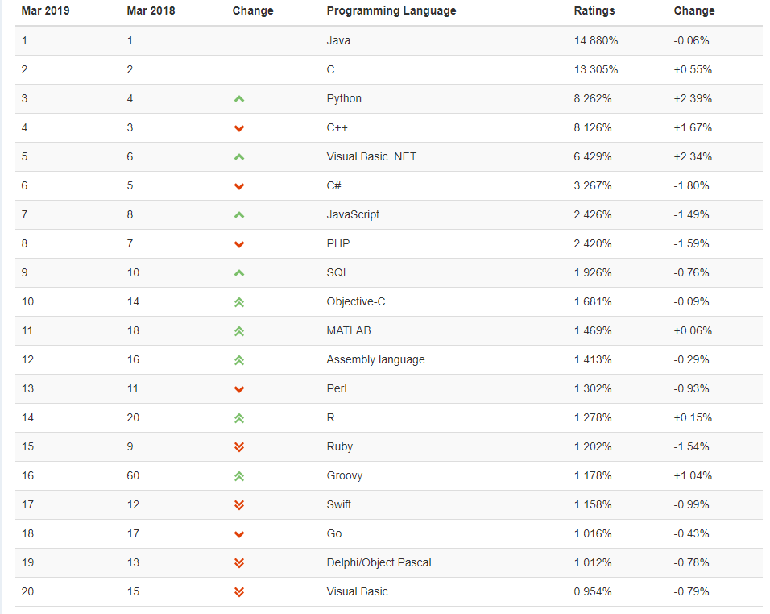


## 3.前期准备

首先显然需要有一台服务器。

买了一台aliyun的ECS实例，首先要把端口打开。因为新创建的实例，就连80端口默认都是不开放的。

这里我就想吐槽一下，国内的vps售价和服务各个方面都跟国外差很多。

首先，价格上，aliyun和vutrl还是比较接近的

aliyun买了之后不能更换实例，vutrl可以销毁实例，再换一台的。

带宽方面，国内的带宽都给的很小气，很贵。

像下面这样，到安全组规则里面，添加一条打开80端口的规则，还有可以开一些其他的端口，给其他服务用。

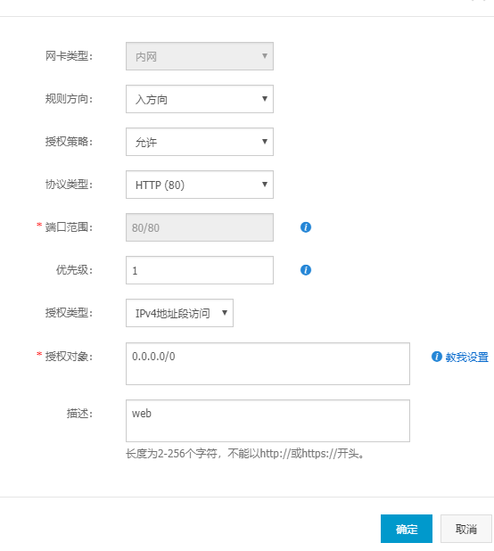


其次我感觉每次代码都要跑到服务器上修改太麻烦了，前期还是放在自己电脑上。


因为没有公网ip，需要进行**内网穿透**

原理要从计算机网络的基础知识讲起。


ipv4的总地址数有限，不到三十亿的地址完全不够全球人民使用。

所以就发明了一些方法，让一个ip地址可以给n台电脑使用。比如说 NAT（Network Address Translation，网络地址转换），用一个有公网ip的设备，建立你的内网ip地址和公网ip的映射关系，然后这个设备就可以转发你的连接。当数据经过这个设备，也就是nat路由器是，会先转换一个外部ip地址发出去，服务器响应也是发到这个路由器，路由器再查表发给你的内网ip。

用的比较多的是natp，也就是内网ip针对路由器的不同端口映射。


内网的机器建立连接之后，nat路由建立的映射总是稳定的，所以nat路由中转，是可以连接到的。但是映射的端口可能会发生变化，所以内网的机器只要定期建立向外的连接，告诉我们映射的端口就行了。

通常在没有外网ip的情况下需要一台有外网ip的服务器做这个中转工作。

内网的主机，每隔一段时间，端口变化就重连远程的vps，vps上的服务，就能知道发包到nat路由的哪个端口就可以发到内网主机上。

和ssh连接一个原理，相当于打通了一条隧道，vps和内网主机之间就可以随便发消息了。然后其他设备可以直接访问你具有公网ip的vps，vps相当于反向代理，把连接通过隧道转发再传回来。


我使用了frp工具做内网穿透，配置比较简单。

分为两个程序，frpc和frps，很明显就是客户端和服务端的区分。家里运行frpc，vps上运行frps

首先在github上找到，release页下载。

windows和linux下载同一个版本号的。

linux 可以用`wegt`下载 ,下载完后是一个`.gz` 的压缩包,用 `tar -xzvf`命令解包。

配置frps.ini文件

服务端绑定的端口就是这个服务监听的端口

```shell
# frps.ini
[common]
bind_port = 3210
token = mudssky
```

然后启动：

因为直接下载`.gz`文件的话，相当于绿色版，直接到解压的文件里运行

```shell
./frps -c ./frps.ini
```


如果需要在后台运行：

```shell
nohup  ./frps -c frps.ini  >> frps.log 2>&1 &
```

1. nohup命令

用途：不挂断地运行命令。

语法：nohup Command [ Arg … ] [　& ]

　　无论是否将 nohup 命令的输出重定向到终端，输出都将附加到当前目录的 nohup.out 文件中。

　　如果当前目录的 nohup.out 文件不可写，输出重定向到 $HOME/nohup.out 文件中。

　　如果没有文件能创建或打开以用于追加，那么 Command 参数指定的命令不可调用。

退出状态：该命令返回下列出口值： 　　

　　126 可以查找但不能调用 Command 参数指定的命令。 　　

　　127 nohup 命令发生错误或不能查找由 Command 参数指定的命令。 　　

　　否则，nohup 命令的退出状态是 Command 参数指定命令的退出状态。

2. &

用途：在后台运行

一般两个一起用

nohup command &

0,1,2这些是linux的文件提示符，分别表示stdin ，stdout，stderr

2>&1 也就是标准错误流重定向到标准输出流，而标准输出流已经被 >>重定向到log文件了，也就是所有输出都丢到log文件里。


然后在家里的win10电脑上配置frpc.ini,注意token要和你服务端的一致

客户端可以随意指定远程端口到本地端口的映射。

比如这样设置ssh之后，远程ssh访问服务器的3222端口就可以转发到win10的22端口了。虽然这在win10上怕是没什么用

```shell
# frpc.ini
[common]
server_addr = 47.97.164.148
server_port = 3210
token= mudssky

[ssh]
type = tcp
local_ip = 127.0.0.1
local_port = 22
remote_port = 3222

[http]
type = tcp
local_ip = 127.0.0.1
local_port = 3000
remote_port = 8000

```

然后在win10上启动这个客户端

```shell
./frpc -c ./frpc.ini
```

可以在win10上写一个go的服务进行测试。

```go
package main

import (
	"fmt"
	"net/http"
)

func handler(writer http.ResponseWriter, request *http.Request) {
	fmt.Fprintf(writer, "Hello World,%s!", request.URL.Path)
}

func main() {
	http.HandleFunc("/", handler)
	fmt.Println("serve is listening localhost:3000...")
	http.ListenAndServe(":3000", nil)

}

```

go run 运行起来，然后你就可以拿出手机，访问`vps ip:remoteport`就可以访问到本地3000端口的服务了。


还可以设置域名，用udp加速传输等等，因为暂时用不到，先不说了。


## 4.开始开发

### 01.项目目录/首页路由

用git来保存代码

先在github建一个项目，然后 `git clone`到本地

关于开源许可证的选择，这里有一张图可以说明，这里我就用Apache许可证了。


目录结构

```powershell
PS D:\code\Projects\goblog> tree
卷 本地磁盘 的文件夹 PATH 列表
卷序列号为 B866-CB3A
D:.
├─conf
├─controllers
├─models
├─routes
├─static
│  ├─css
│  ├─img
│  └─js
├─tests
└─views
└─main.go
PS D:\code\Projects\goblog>
```

个人来说，经验比较少，索性参照了beego搭建的目录。

参考beego作者写的一个web开发教程，之后可能要设计一个小型的web框架。

如作者所说，go默认的路由器功能不够强大

- 不支持参数设定，例如/user/:uid 这种泛类型匹配

- 无法很好的支持REST模式，无法限制访问的方法，GET、POST、DELETE等

  

想看net/http的源码发现因为http协议方面实在了解的不多，所以很多东西看不懂，比如trailer，hijack之类的到底是什么东西。

所以还是跟着这本go web编程作者的思路走吧。http协议相关也要看一下

还是直接上手开干，也不用管框架的事了，写着写着自己就能发现问题了。

先看一下日志模块怎么使用

```go
package main

import (
	"fmt"
	"log"
	"os"
	"time"
)

func main() {
	// 创建输出日志文件
	logFile, err := os.Create("./" + time.Now().Format("20060102") + ".log")
	if err != nil {
		fmt.Println(err)
	}
	// 创建一个Logger
	// 参数一：日志写入目的地
	// 参数二：每条日志的前缀
	// 参数三：日志属性
	loger := log.New(logFile, "[test]:", log.Ldate|log.Ltime|log.Lshortfile)

	// Flags返回Logger的输出选项
	fmt.Println(loger.Flags())

	// SetFlags设置输出选项
	loger.SetFlags(log.Ldate | log.Llongfile | log.Ltime)
	fmt.Println(loger.Flags())

	// Prefix返回loger的输出前缀
	fmt.Println(loger.Prefix())
	// Output写入输出一次日志事件。参数s包含在Logger根据选项生成的前缀之后要打印的文本。如果s末尾没有换行会添加换行符。
	// calldepth用于恢复PC，出于一般性而提供，但目前在所有预定义的路径上它的值都为2。
	loger.Output(2, "举头望明月，低头思故乡")

	// Println调用l.Output将生成的格式化字符串输出到logger，参数用和fmt.Println相同的方法处理。
	loger.Println("白日依山尽，黄河入海流")

	// 打印后触发panic，同样有ln，f之类的结尾的其他函数
	loger.Panicf("hello world,%s\n", "me")

	//获取输出项
	fmt.Println(log.Flags())
	//获取前缀
	fmt.Printf(log.Prefix())
	//输出内容
	log.Output(2, "输出内容")
	//格式化输出
	log.Printf("第%d行 内容:%s", 22, "我是错误")

}

```


还有如何开启静态文件服务器

```go
package main

import (
	"fmt"
	"net/http"
)

func main() {
	// http.ServeFile会自动把url 域名后面的路径提取当做文件路径
	// 使用http.StripPrefix可以实现带路由前缀的静态文件服务
	http.Handle("/static/", http.StripPrefix("/static/", http.FileServer(http.Dir("./static"))))
	http.ListenAndServe(":3333", nil)
}

```


顺便看一下go的标准库template怎么使用，最终我们把首页路由完成

```go
package main

import (
	"html/template"
	"log"
	"net/http"
	"os"
)

// 日志对象，分别用于输出不同级别的日志
var (
	LogDebug   *log.Logger
	LogWarning *log.Logger
	LogPanic   *log.Logger
	LogFatal   *log.Logger
)

type Info struct {
	Name  string
	Email string
}

func init() {
	// 创建输出日志文件
	/*logFile, err := os.Create("./" + time.Now().Format("20060102") + ".log")
	if err != nil {
		fmt.Println(err)
	}*/
	logFile := os.Stdout
	errFile := os.Stderr
	LogDebug = log.New(logFile, "[Debug]:", log.Ldate|log.Ltime|log.Llongfile)
	LogWarning = log.New(logFile, "[Warning]:", log.Ldate|log.Ltime|log.Llongfile)
	LogPanic = log.New(errFile, "[Panic]:", log.Ldate|log.Ltime|log.Llongfile)
	LogFatal = log.New(errFile, "[Fatal]:", log.Ldate|log.Ltime|log.Llongfile)

}
func indexHandle(w http.ResponseWriter, r *http.Request) {
	temp, err := template.ParseFiles("views/index.html")
	if err != nil {
		LogPanic.Panicln("parse template views/index.html failed")
	}
	temp.Execute(w, nil)

}

func main() {
	// 开启静态文件服务，http.StripPrefix提供去掉前缀的静态路由，否则会把路由全部当做路径匹配
	http.Handle("/static/", http.StripPrefix("/static/", http.FileServer(http.Dir("./static"))))
	LogDebug.Println("FileServer start，root ./static")

	// 首页路由
	http.HandleFunc("/", indexHandle)
	err := http.ListenAndServe(":3333", nil)
	if err != nil {
		LogFatal.Fatal("ListenAndServe error")
	}

}

```


设计首页，先有个壳就行。

导航条部分

```html
{{define "navbar"}}
<nav class="navbar navbar-expand-lg navbar-light bg-light">
    <a class="navbar-brand" href="#">Navbar</a>
    <button class="navbar-toggler" type="button" data-toggle="collapse" data-target="#navbarSupportedContent" aria-controls="navbarSupportedContent" aria-expanded="false" aria-label="Toggle navigation">
      <span class="navbar-toggler-icon"></span>
    </button>
  
    <div class="collapse navbar-collapse" id="navbarSupportedContent">
      <ul class="navbar-nav mr-auto">
        <li class="nav-item active">
          <a class="nav-link" href="#">Home <span class="sr-only">(current)</span></a>
        </li>
        <li class="nav-item">
          <a class="nav-link" href="#">Link</a>
        </li>
        <li class="nav-item dropdown">
          <a class="nav-link dropdown-toggle" href="#" id="navbarDropdown" role="button" data-toggle="dropdown" aria-haspopup="true" aria-expanded="false">
            Dropdown
          </a>
          <div class="dropdown-menu" aria-labelledby="navbarDropdown">
            <a class="dropdown-item" href="#">Action</a>
            <a class="dropdown-item" href="#">Another action</a>
            <div class="dropdown-divider"></div>
            <a class="dropdown-item" href="#">Something else here</a>
          </div>
        </li>
        <li class="nav-item">
          <a class="nav-link disabled" href="#">Disabled</a>
        </li>
      </ul>
      <form class="form-inline my-2 my-lg-0">
        <input class="form-control mr-sm-2" type="search" placeholder="Search" aria-label="Search">
        <button class="btn btn-outline-success my-2 my-sm-0" type="submit">Search</button>
      </form>
    </div>
  </nav>
  {{end}}
```


footer 组件

```html
{{define "footer"}} 
    <script src="/static/js/jquery-3.3.1.js"></script>
    <script src="https://cdn.bootcss.com/popper.js/1.12.9/umd/popper.min.js" integrity="sha384-ApNbgh9B+Y1QKtv3Rn7W3mgPxhU9K/ScQsAP7hUibX39j7fakFPskvXusvfa0b4Q" crossorigin="anonymous"></script>
    <script src="/static/js/bootstrap.js"></script>
  </body>
</html>
{{end}}
```


全部拼起来就是首页了

```html
{{define "index"}}<!doctype html>
<html lang="zh">
  <head>
    <!-- Required meta tags -->
    <meta charset="utf-8">
    <meta name="viewport" content="width=device-width, initial-scale=1, shrink-to-fit=no">

    <!-- Bootstrap CSS -->
    <link rel="stylesheet" href="/static/css/bootstrap.css">

    <title>index</title>
  </head>
  <body>
   {{template "navbar"}}

   <div class="container mt-5">
    <div class="card mt-5">
      
      <div class="card-body">
        <h5 class="card-title">Card title</h5>
        <p class="card-text">This is a wider card with supporting text below as a natural lead-in to additional content. This content is a little bit longer.</p>
      </div>
      <div class="card-footer">
        <small class="text-muted">Last updated 3 mins ago</small>
      </div>
    </div>
    <div class="card mt-5">
      <div class="card-body">
        <h5 class="card-title">Card title</h5>
        <p class="card-text">This is a wider card with supporting text below as a natural lead-in to additional content. This content is a little bit longer.</p>
      </div>
      <div class="card-footer">
        <small class="text-muted">Last updated 3 mins ago</small>
      </div>
    </div>
    <div class="card mt-5">
      <div class="card-body">
        <h5 class="card-title">Card title</h5>
        <p class="card-text">This is a wider card with supporting text below as a natural lead-in to additional content. This content is a little bit longer.</p>
      </div>
      <div class="card-footer">
        <small class="text-muted">Last updated 3 mins ago</small>
      </div>
    </div>
   </div>
  
    
    {{template "footer"}}
{{end}}
```


最终效果是这样的

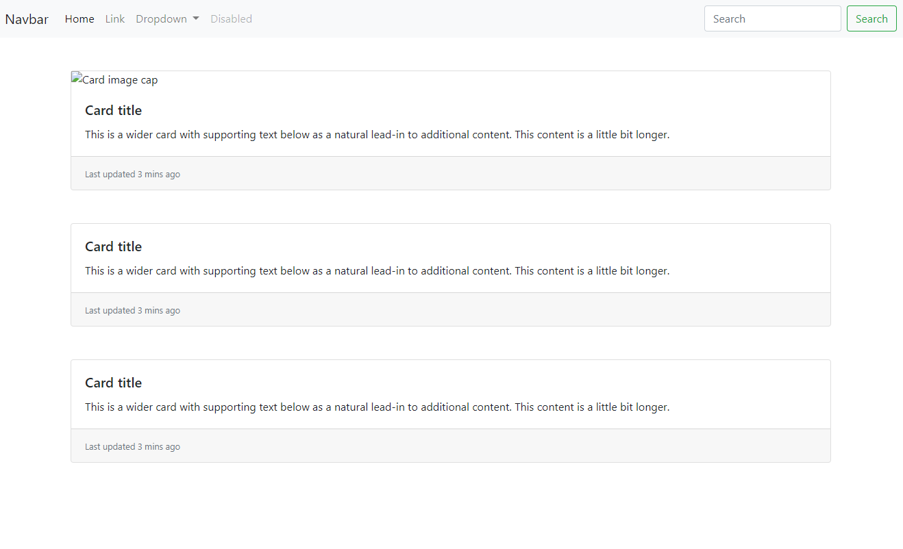

配色之类的以后再加，包括背景图之类。先把基本的功能实现。

下一步我们要实现登录页面

### 02.登录页面、登录逻辑实现

很明显，实现登录，我们需要保存用户名密码等信息，需要在MongoDB中创建一张用户表。

同时我们也要准备写好登录页，以及登录页的路由。


go语言和mongoDB需要使用数据库驱动，目前用的比较多的库是mgo

先安装 `go get gopkg.in/mgo.v2`

由于go语言的包下载很多都需要科学上网来解决。我们可以使用socks5代理来解决这种问题

只需要在shell中设置http代理的环境变量即可

windows下 

```powershell
set http_proxy=http://127.0.0.1:1080
set https_proxy=https://127.0.0.1:1080
```

linux下

```shell
http_proxy=http://127.0.0.1:1080
https_proxy=https://127.0.0.1:1080
```

此时再执行go get 命令，就会经过本地的socks客户端


翻了一下文档，发现这个库已经停止维护了

作者弃坑了。

**THIS IS UNMAINTAINED**

Seven years after creating the mgo driver, I'm formally pausing my work on its maintenance. There are multiple reasons for that, but the main ones are that I've stopped using MongoDB for any new projects, and supporting its good community was taking too much of my personal time without a relevant benefit for those around me.

Moving forward I would suggest you to look at one of these options:

- [globalsign/mgo](https://github.com/globalsign/mgo) - Community supported fork of mgo.
- [BoltDB](https://github.com/coreos/bbolt) - Single file in-memory document database for Go.
- [Badger](https://github.com/dgraph-io/badger) - Fast in-memory document database for Go.
- [DGraph](https://github.com/dgraph-io/dgraph) - Distributed graph database on top of Badger.
- [lib/pq](https://github.com/lib/pq) - PostgreSQL driver in pure Go.


所以我决定用mongodb官方开发的驱动，有mongodb官方维护，更新什么的应该也不会有问题

mongodb官方驱动，似乎还不是很完善，而且语法好像更繁琐一些。mgo作者弃坑，不过交给社区维护了，然而在github上看到最后一次提交是2018年10月，半年多没更新过了。

还是用官方的吧。

先安装：

`go get github.com/mongodb/mongo-go-driver `

出现一个报错

```
can't load package: package github.com/mongodb/mongo-go-driver/mongo: code in directory D:\code\GOPATH\src\github.com\mongodb\mongo-go-driver\mongo expects import "go.mongodb.org/mongo-driver/mongo"
```

所以我试试执行 `go get go.mongodb.org/mongo-driver/mongo`

vscode中执行 从 go.mongodb.org/mongo-driver/mongo这个目录import就没问题了。


官方推荐的安装方式是：

```
dep ensure -add "go.mongodb.org/mongo-driver/mongo@~1.0.0"
```

dep是go语言的包管理工具，在我看来就相当于nodejs的包管理工具npm

我们使用go get 下载包，没有版本控制的功能，dep可以解决这个问题。

首先安装 `go get -u github.com/golang/dep/cmd/dep`

然后我们把 dep.exe加到环境变量，这里我就直接把GOPATH的bin文件夹加到环境变量里了。

先学习一下怎么使用

首先在GOPATH src目录下，添加一个GOPROJECTS目录，项目移到这个目录里。

dep强制要你把项目放在GOPATH的src目录下，可以说是比较死板了。

在项目目录下执行 `dep init`

第一次执行会显得很慢。还会报错。

我们先在一个空文件夹中执行看看效果

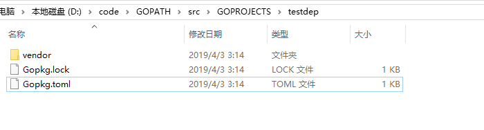

会生成上面几个文件。

Gopkg.toml，很明显和package.json类似是用来写依赖和约束的。

我看了一半文档，又发现，dep这个包管理工具又有新闻。dep这个工具本来是有作为官方工具的可能的。结果dep的开发者和go官方的人员矛盾了，官方自己出了一套工具，go mod。


所以说我还是用官方工具吧，也不用安装，方便一些。

正好dep init执行失败了还不知道怎么处理

go mod 功能简单很多，目前还不是很完善，不过不用把项目搬到GOPATH 的src目录下了

在目录下执行`go mod init` 会自动创建一个go.mod文件，然后以后go build的时候可以自动把你的依赖写到这个文件里。

**go mod命令**

```
download    download modules to local cache (下载依赖的module到本地cache))
edit        edit go.mod from tools or scripts (编辑go.mod文件)
graph       print module requirement graph (打印模块依赖图))
init        initialize new module in current directory (再当前文件夹下初始化一个新的module, 创建go.mod文件))
tidy        add missing and remove unused modules (增加丢失的module，去掉未用的module)
vendor      make vendored copy of dependencies (将依赖复制到vendor下)
verify      verify dependencies have expected content (校验依赖)
why         explain why packages or modules are needed (解释为什么需要依赖)
```

**显示所有Import库信息**

```
go list -m -json all
```

- `-json` JSON格式显示
- `all` 显示全部库

**Mod Cache 路径**

默认在`$GOPATH/pkg` 下面：

```
$GOPATH/pkg/mod
```

我们来看看一个项目下载下来的文件形式：


```
➜  mod ls -lh cache/download/github.com/go-kit/kit/@v/
total 3016
-rw-r--r--  1 a1  staff     7B Sep 29 15:37 list
-rw-------  1 a1  staff    50B Sep 29 15:37 v0.7.0.info
-rw-------  1 a1  staff    29B Sep 29 15:37 v0.7.0.mod
-rw-r--r--  1 a1  staff   1.5M Sep 29 15:37 v0.7.0.zip
-rw-r--r--  1 a1  staff    47B Sep 29 15:37 v0.7.0.ziphash
```

可以看出项目库会对每个版本创建一个文件夹，文件夹下有对于版本的信息。


总之暂时不用多操心了，接着写user表结构


发现mongodb的官方驱动真的难用。文档也少，官方给的示例让我感觉很难受。

果然只有mgo可以用，官方库完全没有go的风格。功能让人难受，暂时还不适合使用。

下载社区维护的mgo

`go get github.com/globalsign/mgo`

测试代码如下

```go
package main

import (
	"fmt"
	"log"

	"github.com/globalsign/mgo"
	"github.com/globalsign/mgo/bson"
)

// User 用户表的一行信息 包括用户名 密码
// 暂时先使用明文存储密码
type User struct {
	ID       bson.ObjectId `bson:"_id"`
	Username string        `bson:"username"`
	Password string        `bson:"password"`
}

func main() {
	// Dial可以设置多个服务器，这里就一个
	session, err := mgo.Dial("127.0.0.1:27017")
	if err != nil {
		panic(err)
	}
	defer session.Close()
	//设置连接模式，有三种连接模式，默认是strong，即只连接主服务器，一直使用一个连接，因此所有的读写操作会完全的一致
	// 另外两个模式是多个服务器情况下使用的
	// Monotonic 这个模式读取的不一定是最新的数据，首先向其他服务器发起连接，只要出现了一次写操作，session的连接就会切换到主服务器。
	// Eventual 这个模式的读操作会向任意其他服务器发起，多次读操作并不一定使用相同的连接，也就是读操作不一定有序。
	// session的写操作总是向主服务器发起，但是可能使用不同的连接，也就是写操作也不一定有序
	// session.SetMode(mgo.Monotonic)
	// 因为我们用默认的就行了，所以不用进行设置

	c := session.DB("goblog").C("user")
	err = c.Insert(&User{ID: bson.NewObjectId(), Username: "abc3", Password: "123456"})
	if err != nil {
		log.Fatal(err)
	}
	result := User{}
	err = c.Find(bson.M{"username": "abc3"}).One(&result)
	if err != nil {
		log.Fatal(err)
	}
	fmt.Println(result)
}

```


了解了驱动的简单使用之后，我们可以开始写登录页了。

登录和注册功能顺便一同实现了。但是作为一个个人网站，他人的交互不是很需要，简单实现注册功能后，并不开放，同时登录页也不提供进入的链接。


完善基本的User 的schema

```go
type User struct {
	ID           bson.ObjectId `bson:"_id"`
	Username     string        `bson:"username"`
	Password     string        `bson:"password"`
	PasswordHash string        `bson:"passwordhash,omitempty"`
	Nickname     string        `bson:"nickname,omitempty"`
	Email        string        `bson:"email"`
}

```


发现go语言需要workspace立面写代码，不然导入包的时候无法从当前目录下导入。

所以还是把整个项目移动到gopath下了。


实现注册页

```HTML
{{template "header"}}
{{template "navbar"}}

<div class="container mt-3">
    {{if .}}
        <div class="alert alert-danger" role="alert">
               {{.}}
        </div>
    {{end}}
        <form method="POST" action="/signup">
            <div class="form-group">
                <label for="InputUsername">Username</label>
                <input type="text" class="form-control" id="InputUsername" name="Username" placeholder="Enter Username">
                <!-- <small id="emailHelp" class="form-text text-muted">We'll never share your email with anyone else.</small> -->
            </div>
            <div class="form-group">
                    <label for="InputEmail">Email</label>
                    <input type="email" class="form-control" id="InputEmail" name="Email" placeholder="Enter your Email address">
                    <!-- <small id="emailHelp" class="form-text text-muted">We'll never share your email with anyone else.</small> -->
                </div>
            <div class="form-group">
                <label for="InputPassword">Password</label>
                <input type="password" class="form-control" id="InputPassword" name="Password" placeholder="Password">
            </div>
            <div class="form-group">
                    <label for="InputPassword2">Repeat Password</label>
                    <input type="password" class="form-control" id="InputPassword2" name="RepeatPassword" placeholder="confirm your password">
                </div>
            <button type="submit" class="btn btn-primary">Submit</button>
        </form>
</div>
{{template "footer"}}
```

注册页效果如下：

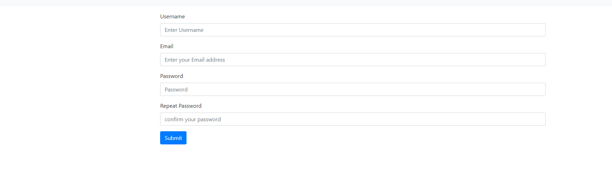


注册路由逻辑实现

```go
路由 http.HandleFunc("/signup", SignupHandle)

// SignupHandle 处理注册页面的逻辑
func SignupHandle(w http.ResponseWriter, r *http.Request) {
	if r.Method == "GET" {
		temp, err := template.ParseFiles("views/signup.html", "views/components/navbar.html", "views/components/footer.html", "views/components/header.html")
		if err != nil {
			LogPanic.Panicln("parse template views/index.html failed", err)
		}
		err = temp.ExecuteTemplate(w, "signup.html", nil)
		if err != nil {
			LogPanic.Panicln("parse template views/signin.html failed")
		}
		return
	}
	if r.Method == "POST" {
		// 解析表单数据
		r.ParseForm()
		// var errorMessage string
		// 对表单数据进行验证
		errorMessage := validateSignup(r.Form)
		// 如果errorMessage=""，说明验证都能正常通过，我们还要验证用户名是否重复，查询mongodb中的用户表
		if errorMessage == "" && user.CheckUserName(r.Form["Username"][0]) {
			errorMessage = "输入的用户名已经存在"
		}
		if errorMessage != "" {
			temp, err := template.ParseFiles("views/signup.html", "views/components/navbar.html", "views/components/footer.html", "views/components/header.html")
			if err != nil {
				LogPanic.Panicln("parse all templates failed", err)
			}
			err = temp.ExecuteTemplate(w, "signup.html", errorMessage)
			if err != nil {
				LogPanic.Panicln("parse template views/signup.html failed")
			}
		} else {
			
				err := user.InsertUser(&user.User{Username: r.Form["Username"][0], Password: r.Form["Password"][0], Email: r.Form["Email"][0], ID: bson.NewObjectId()})
			if err != nil {
				log.Panicln("insert user failed", err)
			}
			http.Redirect(w, r, "/signin", http.StatusFound)
		}
		// r.Form["Username"]
	}
}

```


除此之外我们应该实现一个显示提示信息的功能。注册成功后应该直接跳转到登录页。显示成功提示信息

另外登录成功后我们要记录登录状态，也就是需要实现session功能。

session也即在客户端cookie存放一个序号，然后数据在服务端，可以根据这个序号来取。

可以在mongodb直接建一个表来存储实现。还需要生成唯一session id的一个函数。

在mongodb中存储，这样每次确认登录状态都要请求数据库，可能效率上不太好。

下面我们先来实现这个session的功能。


不用很麻烦，只要有一个生成GUID的方法，然后就是根据cookie中的sessionID获得结构体中的map，并且可以设置值。

```go
// Package session 使用monggodb进行session存储
// 使用方法
// sess:=session.New() 新建一个session结构体
// sess=sess.StartSession()  从数据库中获取数据到session对象
// sess.Set()   sess.Get()
// sess.Save()   设置完在之后，使用Save方法持久化保存到数据库里
package session

import (
	"crypto/rand"
	"encoding/base64"
	"io"
	"log"
	"net/http"
	"net/url"
	"time"

	"github.com/globalsign/mgo"
	"github.com/globalsign/mgo/bson"
)

// Session Session的结构体
type Session struct {
	CookieName  string `bson:"cookiename"`
	SessionID   string `bson:"sessionid"`
	Maxlifetime int    `bson:"maxlifetime"`
	// 最大生存时间，时间为秒
	// Data        map[string]interface{} `bson:"Data"`
	// Data bson.M `bson:"data,omitempty"`
	Data map[string]interface{} `bson:"data"`
}

var (
	// 数据库会话，数据库，以及集合
	session    *mgo.Session
	database   *mgo.Database
	collection *mgo.Collection
)

// GenSessionID 生成一个SessionID
func (s *Session) GenSessionID() string {
	b := make([]byte, 64)
	if _, err := io.ReadFull(rand.Reader, b); err != nil {
		return ""
	}
	return base64.URLEncoding.EncodeToString(b)
}

// SessionStart ,获取session，如果不能从cookie中获取SessionID就新创建一个session并加入mongodb同时设置cookie
func (s *Session) SessionStart(w http.ResponseWriter, r *http.Request) (session *Session) {
	cookie, err := r.Cookie(s.CookieName)
	log.Println("SessionStart cookie:", cookie.Value)
	// log.Println("SessionStart sid:", s.SessionID)
	// 如果cookie中找不到SessionID的值，说明客户端没有sessionID或者cookie被删除，新建一个session并加入到cookie中
	if err != nil || cookie.Value == "" {
		sid := s.SessionID
		// log.Println(1)
		// url.QueryEscape()是将字符串转换成url编码
		// 创建一个新的SessionID后，我们把它加入到mongodb中
		cookie := http.Cookie{Name: s.CookieName, Value: url.QueryEscape(sid), Path: "/", HttpOnly: true, MaxAge: s.Maxlifetime}
		s.insertNewSession(s)
		http.SetCookie(w, &cookie)
	} else {
		// log.Println(2)
		sid, _ := url.QueryUnescape(cookie.Value)
		err := s.GetAllData(sid)
		log.Println("SessionStart sid:", s.SessionID)
		session = s
		// 如果数据获取出错，说明本地的session数据被删除了，或者客户端伪造了sessionID
		// 此时我们需要重设session，因为登录会设置signin标志，所以不会影响到登录部分的安全性。伪造的情况一样重设逻辑，但是普通的session没有signin标记并没什么用。
		if err != nil {
			// log.Println(3)
			log.Println("get session Data error", err)
			sess := New()
			cookie := http.Cookie{Name: sess.CookieName, Value: url.QueryEscape(sess.SessionID), Path: "/", HttpOnly: true, MaxAge: sess.Maxlifetime}
			s.insertNewSession(sess)
			http.SetCookie(w, &cookie)
			session = sess
		}
	}
	return
}

// Init 初始化一个session
func (s *Session) Init() (session *Session) {
	sid := s.GenSessionID()
	data := make(map[string]interface{})
	session = &Session{CookieName: "mod", SessionID: sid, Maxlifetime: 60 * 60 * 24 * 7, Data: data}
	return
}

// New 返回一个初始化好的session
func New() *Session {
	return new(Session).Init()
}

func (s *Session) insertNewSession(session *Session) {
	c := GetCollection()
	err := c.Insert(session)
	if err != nil {
		log.Println("insert session error", err)
	}
}

// GetAllData 从monggodb中获取所有session信息
func (s *Session) GetAllData(SessionID string) (err error) {
	c := GetCollection()
	err = c.Find(bson.M{"sessionid": SessionID}).One(s)
	return
}

// GetAllData 从monggodb中获取所有session信息,返回errnotfound说明查找不到对应的session信息，可能没有创建也可能过期被删除了
func GetAllData(SessionID string) (session Session, err error) {
	c := GetCollection()
	err = c.Find(bson.M{"sessionid": SessionID}).One(&session)
	return
}

// Set 设置session键值
func (s *Session) Set(key string, value interface{}) {
	log.Println(s)
	log.Println("set", s.Data)
	s.Data[key] = value
}

// SetAndSave 设置session键值,并且持久化到数据库
func (s *Session) SetAndSave(key string, value interface{}) {
	s.Data[key] = value
	s.Save()
}

// Get 获取session某个键的值
func (s *Session) Get(key string) interface{} {
	return s.Data[key]
}

// Save 设置完session的Data值后要保存到数据库里
func (s *Session) Save() (err error) {
	c := GetCollection()
	err = c.Update(bson.M{"sessionid": s.SessionID}, bson.M{"$set": bson.M{"data": s.Data}})
	return
}

// Destroy 从数据库中删除session
func (s *Session) Destroy(SessionID string) {
	c := GetCollection()
	c.Remove(bson.M{"Sessionid": SessionID})
}
func init() {
	dialInfo := &mgo.DialInfo{
		Addrs:     []string{"127.0.0.1:27017"},
		Timeout:   time.Second * 1,
		PoolLimit: 4096,
	}
	// 创建一个维护套接字池的session
	session, err := mgo.DialWithInfo(dialInfo)
	if err != nil {
		log.Panicln("dial Database failed", err)
	}
	database = session.DB("goblog")
	collection = database.C("session")
}

// GetDatabase 获取数据库对象
func GetDatabase() *mgo.Database {
	return database
}

// GetCollection 获取集合对象
func GetCollection() *mgo.Collection {
	return collection
}

/*func main() {

}
*/


```


本来考虑注册成功增加一个跳转页，可以放一些提示信息。

姑且实现了一个简陋的跳转页

效果如下

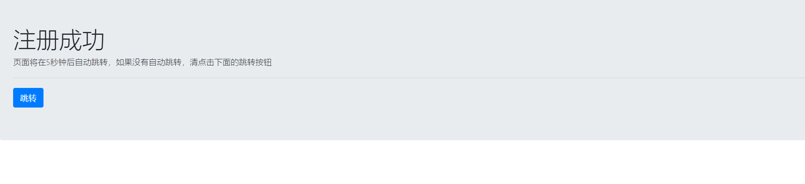

跳转页实现


```html
<html lang="zh">
  <head>
    <!-- Required meta tags -->
    <meta charset="utf-8">
    <meta name="viewport" content="width=device-width, initial-scale=1, shrink-to-fit=no">
    <meta http-equiv="refresh" content="50;URL=/signin">
    <!-- Bootstrap CSS -->
    <link rel="stylesheet" href="/static/css/bootstrap.css">

    <title>index</title>
  </head>
<body>
<div class="jumbotron">
    <h1 class="display-4">注册成功</h1>
    <p class="lead">页面将在5秒钟后自动跳转，如果没有自动跳转，清点击下面的跳转按钮</p>
    <hr class="my-4">
    <!-- <p>It uses utility classes for typography and spacing to space content out within the larger container.</p> -->
    <p class="lead">
      <a class="btn btn-primary btn-lg" href="{{.url}}" role="button">跳转</a>
    </p>
  </div>

```


又碰到很多坑，go语言最大的缺点就是文档比较差，不够完善，然后轮子也很少。

不过我目前碰到的问题都是因为标准库的文档不完善。

关于go 模板的使用，嵌套模板不能传值，让我折腾了半天。

其实只要在主模板导入其他模板的时候 `{{template “模板名” 参数}}`这样在执行`   err = temp.ExecuteTemplate(w, "index", sess.Data)`,就可以把对应的参数传到嵌套模板里了。


还有就是go http包默认的路由让我费解。因为我有遇到了bug，自己编写的session包使用的时候。

首先最初有一个问题是mongodb中一直插入一些空文档，这个问题是因为go语言中貌似首字母大写的内容才能导出。所以我把结构体首字母都变成大写，就可以了。


还有一点是访问首页的时候，会请求3次session。

我发现，开发之前先看一下源码还是必须的。http包的原理，底层实现可以说不是很懂。但是之前确实也看过，感觉对于现在的我来说有点复杂了。所以就想着先写点应用的代码锻炼锻炼。


这次碰到的bug算是逼我看源码的。因为需要了解go http默认的路由规则，自己写一个路由的处理器倒还不是很有必要，因为就目前这个项目而言，默认的已经够用了。

我折腾了半天，原来我以为是setCookie，的时候，会让客户端刷新，所以多请求了，结果并不是。

后来我发现，你请求一些路由我没有设置的地址，最后都会跳到首页。

然后我发现不得不去看源码了解一下情况了。因为一个页面多请求两次session效率实在太低。本来session不存储在内存里就已经效率很低了。

先从HandleFunc入手，这是一个注册路由处理器的函数

```go
// HandleFunc registers the handler function for the given pattern
// in the DefaultServeMux.
// The documentation for ServeMux explains how patterns are matched.
func HandleFunc(pattern string, handler func(ResponseWriter, *Request)) {
	DefaultServeMux.HandleFunc(pattern, handler)
}

```

我们发现，他调用了默认路由处理的方法

```go
// HandleFunc registers the handler function for the given pattern.
func (mux *ServeMux) HandleFunc(pattern string, handler func(ResponseWriter, *Request)) {
	if handler == nil {
		panic("http: nil handler")
	}
	mux.Handle(pattern, HandlerFunc(handler))
}

```

mux.handler 执行了路由登记

我们发现，正常的pattern会被直接放到mux.m这个map里

如果是以/结尾，那么还会放到一个排好序的切片里mux.es

```go
// Handle registers the handler for the given pattern.
// If a handler already exists for pattern, Handle panics.
func (mux *ServeMux) Handle(pattern string, handler Handler) {
	mux.mu.Lock()
	defer mux.mu.Unlock()

	if pattern == "" {
		panic("http: invalid pattern")
	}
	if handler == nil {
		panic("http: nil handler")
	}
	if _, exist := mux.m[pattern]; exist {
		panic("http: multiple registrations for " + pattern)
	}

	if mux.m == nil {
		mux.m = make(map[string]muxEntry)
	}
	e := muxEntry{h: handler, pattern: pattern}
	mux.m[pattern] = e
	if pattern[len(pattern)-1] == '/' {
		mux.es = appendSorted(mux.es, e)
	}

	if pattern[0] != '/' {
		mux.hosts = true
	}
}
```


以上是登记时的规则

我们再看路由分配时的规则

```go

// ServeHTTP dispatches the request to the handler whose
// pattern most closely matches the request URL.
func (mux *ServeMux) ServeHTTP(w ResponseWriter, r *Request) {
	if r.RequestURI == "*" {
		if r.ProtoAtLeast(1, 1) {
			w.Header().Set("Connection", "close")
		}
		w.WriteHeader(StatusBadRequest)
		return
	}
	h, _ := mux.Handler(r)
	h.ServeHTTP(w, r)
}
```

mux.Handler方法

它内部调用了另一个小写的mux.handler

这个方法中我们可以看出，如果路由不是以/结尾，并且再mux.m中没找到的话，会加上/再重定向一次。

```go
// Handler returns the handler to use for the given request,
// consulting r.Method, r.Host, and r.URL.Path. It always returns
// a non-nil handler. If the path is not in its canonical form, the
// handler will be an internally-generated handler that redirects
// to the canonical path. If the host contains a port, it is ignored
// when matching handlers.
//
// The path and host are used unchanged for CONNECT requests.
//
// Handler also returns the registered pattern that matches the
// request or, in the case of internally-generated redirects,
// the pattern that will match after following the redirect.
//
// If there is no registered handler that applies to the request,
// Handler returns a ``page not found'' handler and an empty pattern.
func (mux *ServeMux) Handler(r *Request) (h Handler, pattern string) {

	// CONNECT requests are not canonicalized.
	if r.Method == "CONNECT" {
		// If r.URL.Path is /tree and its handler is not registered,
		// the /tree -> /tree/ redirect applies to CONNECT requests
		// but the path canonicalization does not.
		if u, ok := mux.redirectToPathSlash(r.URL.Host, r.URL.Path, r.URL); ok {
			return RedirectHandler(u.String(), StatusMovedPermanently), u.Path
		}

		return mux.handler(r.Host, r.URL.Path)
	}

	// All other requests have any port stripped and path cleaned
	// before passing to mux.handler.
	host := stripHostPort(r.Host)
	path := cleanPath(r.URL.Path)

	// If the given path is /tree and its handler is not registered,
	// redirect for /tree/.
	if u, ok := mux.redirectToPathSlash(host, path, r.URL); ok {
		return RedirectHandler(u.String(), StatusMovedPermanently), u.Path
	}

	if path != r.URL.Path {
		_, pattern = mux.handler(host, path)
		url := *r.URL
		url.Path = path
		return RedirectHandler(url.String(), StatusMovedPermanently), pattern
	}

	return mux.handler(host, r.URL.Path)
}

```

```go
// handler is the main implementation of Handler.
// The path is known to be in canonical form, except for CONNECT methods.
func (mux *ServeMux) handler(host, path string) (h Handler, pattern string) {
	mux.mu.RLock()
	defer mux.mu.RUnlock()

	// Host-specific pattern takes precedence over generic ones
	if mux.hosts {
		h, pattern = mux.match(host + path)
	}
	if h == nil {
		h, pattern = mux.match(path)
	}
	if h == nil {
		h, pattern = NotFoundHandler(), ""
	}
	return
}
```


再看到具体match时的方法

我们发现，先是在mux.m这个map种查找，如果找不到，就会到按长度排好序的数组中查找，寻找有最长公共前缀的

```go
// Find a handler on a handler map given a path string.
// Most-specific (longest) pattern wins.
func (mux *ServeMux) match(path string) (h Handler, pattern string) {
	// Check for exact match first.
	v, ok := mux.m[path]
	if ok {
		return v.h, v.pattern
	}

	// Check for longest valid match.  mux.es contains all patterns
	// that end in / sorted from longest to shortest.
	for _, e := range mux.es {
		if strings.HasPrefix(path, e.pattern) {
			return e.h, e.pattern
		}
	}
	return nil, ""
}
```


所以说我又对Index路由进行了更改，加上了404页面

如图，设计了简陋的404页面


```html
<!DOCTYPE html>
<html lang="en">
<head>
    <meta charset="UTF-8">
    <meta name="viewport" content="width=device-width, initial-scale=1.0">
    <meta http-equiv="X-UA-Compatible" content="ie=edge">
    <title>404</title>
</head>
<body>
    <h1>404 NOT FOUND</h1>
    <a href="/">点击返回首页</a>
</body>
</html>
```

首页路由的修改如下

```go
// IndexHandle 处理首页的逻辑
func IndexHandle(w http.ResponseWriter, r *http.Request) {
	if r.URL.Path == "/" {
		LogDebug.Println("path", "/")
		// 解析需要的模板
		temp, err := template.ParseFiles("views/index.html", "views/components/navbar.html", "views/components/footer.html",
			"views/components/header.html")
		// temp, err := template.ParseFiles("views/index.html")
		if err != nil {
			LogPanic.Panicln("parse template views/index.html failed", err)
		}
		// 获取session中的数据
		sess := session.New()
		sess = sess.SessionStart(w, r)
		// SessionMap = sess.Data
		// LogDebug.Println(sess.Data["signin"])
		err = temp.ExecuteTemplate(w, "index", sess.Data)
		if err != nil {
			LogPanic.Panicln("parse template views/index.html failed")
		}
		// http包默认的路由规则，按照最长前缀匹配
		// 所有路径都可以匹配到/,那样404页面就失去作用了，所以当/匹配失败的时候展示404页面
	} else {
		temp, err := template.ParseFiles("views/404.html")
		// temp, err := template.ParseFiles("views/index.html")
		if err != nil {
			LogPanic.Panicln("parse template views/404.html failed", err)
		}
		err = temp.ExecuteTemplate(w, "404.html", nil)
		if err != nil {
			LogPanic.Panicln("parse template views/404.html failed")
		}
	}

}
```


登录页面逻辑已完成

```go
// SigninHandle 处理登录页的逻辑
func SigninHandle(w http.ResponseWriter, r *http.Request) {
	LogDebug.Println("path", "/signin")
	// GET请求返回登录页
	if r.Method == "GET" {
		// 解析需要的模板
		temp, err := template.ParseFiles("views/signin.html", "views/components/navbar.html", "views/components/footer.html", "views/components/header.html")
		if err != nil {
			LogPanic.Panicln("parse template views/index.html failed", err)
		}
		err = temp.ExecuteTemplate(w, "signin.html", nil)
		if err != nil {
			LogPanic.Panicln("parse template views/signin.html failed")
		}
		return
	}
	// POST请求，处理登录逻辑
	if r.Method == "POST" {
		r.ParseForm()
		var errorMessage string
		errorMessage = validateSignin(r.Form)
		// 如果登陆过程出错，仍显示登录页，并显示错误信息
		if errorMessage != "" {
			temp, err := template.ParseFiles("views/signin.html", "views/components/navbar.html", "views/components/footer.html", "views/components/header.html")
			if err != nil {
				LogPanic.Panicln("parse template views/index.html failed", err)
			}
			err = temp.ExecuteTemplate(w, "signin.html", errorMessage)
			if err != nil {
				LogPanic.Panicln("parse template views/signin.html failed")
			}
			// 如果登陆成功，跳转到首页，并把登陆状态加入到session
		} else {
			sess := session.New()
			// sess.Set("dsa", "dsa")
			// sess.Save()
			// fmt.Println(sess)
			sess = sess.SessionStart(w, r)
			// 登陆成功，自动跳转到首页,设置session记录登录状态
			sess.Set("signin", true)
			sess.Save()
			message := MessagePage{Message: "登录成功", URL: "/"}
			temp, err := template.ParseFiles("views/messagepage.html", "views/components/footer.html")
			if err != nil {
				LogPanic.Panicln("parse all templates failed", err)
			}
			err = temp.ExecuteTemplate(w, "messagepage.html", message)
			if err != nil {
				LogPanic.Panicln("parse template views/messagepage.html failed")
			}
			// http.Redirect(w,r,"/",http.StatusFound)
		}
	}
}
```


### 03.文章model、页面以及增删改查实现

​	首先我们先实现文章的创建页。

​	我们需要实现一个文本编辑器，方便以后我们写文章。网页上的文本编辑器应该不如本地编辑器的使用体验好，我可能不会经常使用这个功能，但是也是个挺常用的功能了，总是有可能用到的。

​	首先我们设计文章的结构体如下：

```go
// Post 文章的结构体
type Post struct {
	ID           bson.ObjectId       `bson:"_id"`
	IDhex        string              `bson:"idhex"`
	Author       string              `bson:"author"`
	Title        string              `bson:"title"`
	Content      string              `bson:"content"`
	CreatAt      bson.MongoTimestamp `bson:"creatat"`
	LastModified bson.MongoTimestamp `bson:"lastmodified"`
	Category     string              `bson:"category"`
}

```


有很多开源免费的文本编辑器可以使用，所以我们就不必自己造轮子了。

在github中检索editor，按照star数排列，能看到还是有很多不错的项目的。

搜索到的信息有代码编辑器，也有网站上使用的富文本编辑器，第一名是vscode，可以说很自然。

最终我选择使用[stackedit](https://github.com/benweet/stackedit)，这是个markdown编辑器。我发现普通的富文本编辑器，功能太多太繁琐，还是markdown编辑器比较舒服。

而且这个据说是 Stack Overflow也在使用的编辑器。

这个编辑器具体效果如下

使用iframe实现的，随时打开关闭，而且还支持所见即所得。

除了编辑markdown之外，还可以解析markdown，所以也省得引用其他的库了。

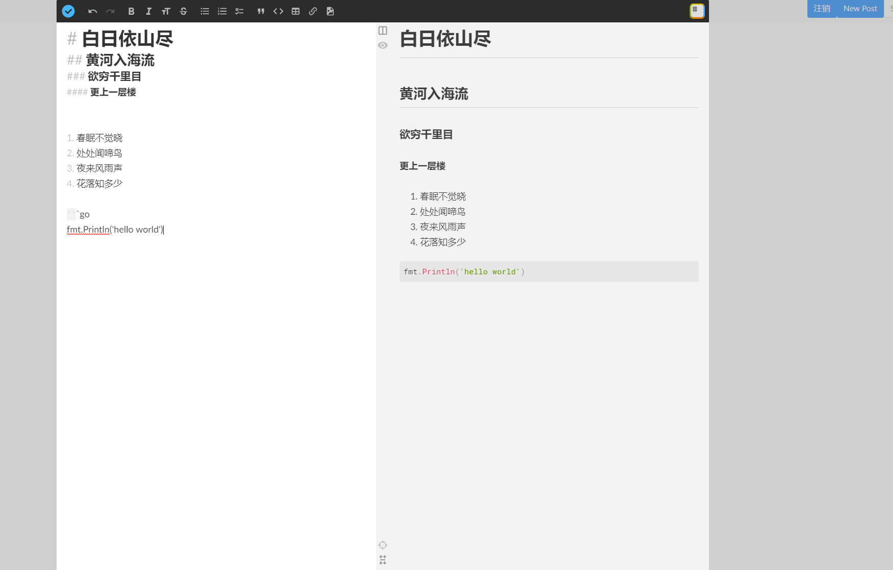

只要下载下来，参照文档使用API即可，虽然文档给的并不太详细，但是还算够用。基本的功能已经可以满足。

新建文章的页面设计如下

```html
{{template "header"}}
{{template "navbar" .}}
<div class="container mt-5">
  <form action="/post/new" method="POST">
      <div class="form-group row">
          <label for="inputAuthor" class="col-sm-2 col-form-label">Author</label>
          <div class="col-sm-10">
            <input type="text" readonly class="form-control-plaintext" name="Author" id="inputAuthor" value="{{.username}}">
          </div>
        </div>
        <div class="form-group row">
          <label for="inputTitle" class="col-sm-2 col-form-label">Title</label>
          <div class="col-sm-10">
            <input type="text" class="form-control" id="inputTitle" name="Title" placeholder="Title">
          </div>
        </div>
        <div class="form-group row">
            <label for="inputCategory" class="col-sm-2 col-form-label">Category</label>
            <div class="col-sm-10">
              <input type="text" class="form-control" id="inputCategory" name="Category" placeholder="Category">
            </div>
          </div>
      <textarea name="Content" id="textarea"  rows="30" class="form-control"></textarea>
      <button  type="submit" class="btn btn-primary form-control" id="" >Submit</button>
  </form>
  <button class="btn btn-primary form-control" id="openEdit">Edit with StackEdit</button>
</div>
<script src="/static/js/benweet-stackedit.js-5f37fa9/docs/lib/stackedit.min.js"></script>
<script>
 const el = document.querySelector('#textarea');
 const btn=document.querySelector("#openEdit")
  const stackedit = new Stackedit();

  // Open the iframe
  // stackedit.openFile({
  //   name: 'Filename', // with an optional filename
  //   content: {
  //     text: el.value // and the Markdown content.
  //   }
  // });

  // Listen to StackEdit events and apply the changes to the textarea.
  stackedit.on('fileChange', (file) => {
    el.value = file.content.text;
  });
  btn.addEventListener("click",function(){
    stackedit.openFile({
    name: 'textOnEdit', // with an optional filename
    content: {
      text: el.value // and the Markdown content.
    }
  });
  })
</script>
{{template "footer"}}
```

页面效果如下：

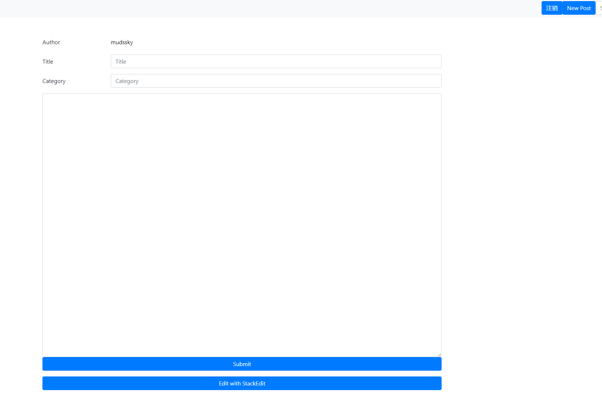

路由实现如下

```go
// NewPostHandle 新建一篇文章
func NewPostHandle(w http.ResponseWriter, r *http.Request) {
	// 首先开启session,检查登录状态
	sess := session.New()
	sess = sess.SessionStart(w, r)
	if checkSignin(sess.Data)!= true {
		return
	}
	if r.Method == "GET" {
		temp, err := template.ParseFiles("views/newpost.html", "views/components/navbar.html", "views/components/footer.html",
			"views/components/header.html")
		if err != nil {
			LogPanic.Panicln("parse template views/newpost.html failed", err)
		}
		err = temp.ExecuteTemplate(w, "newpost.html", sess.Data)
		if err != nil {
			LogPanic.Panicln("parse template views/newpost.html failed", err)
		}
		return
	}
	if r.Method == "POST" {
		r.ParseForm()
		Author := r.Form["Author"][0]
		Title := r.Form["Title"][0]
		Content := r.Form["Content"][0]
		Category := r.Form["Category"][0]
		newpost := post.New(Author, Title, Content, Category)
		err := newpost.Add()
		var message MessagePage
		if err != nil {
			message = MessagePage{Message: "保存文章失败，请重试", URL: "/post/new"}

		}
		message = MessagePage{Message: "保存文章成功", URL: "/post/new"}
		temp, err := template.ParseFiles("views/messagepage.html", "views/components/footer.html")
		if err != nil {
			LogPanic.Panicln("parse all templates failed", err)
		}
		err = temp.ExecuteTemplate(w, "messagepage.html", message)
		if err != nil {
			LogPanic.Panicln("parse template views/messagepage.html failed", err)
		}

	}
}

```

其中checkSignin是封装了一个检查登录状态的函数

```go
func checkSignin(sessionData map[string]interface{}) bool {
	if sessionData["signin"] == true {
		return true
	}
	return false
}
```


实现完新建文章的功能之后。

我们需要验证这个功能，首先是查看一下控制台输出和mongodb中的数据。

其次我们要实现首页的文章展示，以后还要实现分页，不过现在倒不着急，因为也没几篇文章。

首先执行一段mongodb shell，增加几篇文章等会效果看得明显一点。

类似于下面的代码

```js
for (var i=0;i<10;i++){
    db.post.insertOne({title:'dsadas',author:'mudssky',content:''+i})
}
```

然后我们编写首页，把文章都渲染出来

渲染部分代码如下

因为目前重在实现功能，所以页面细节上就随意了。等功能完整了再调整页面

```html
     {{range .postindex}}
    <div class="card mt-5">
      <!--  -->
      <a href="/postid?id={{.idhex}}" class="btn">
          <div class="card-body">
              <h5 class="card-title">{{.title}}</h5>
              <p class="card-text">{{.author}}</p>
              <p class="card-text">{{.category}}</p>
            </div>
      </a>
      <div class="card-footer">
        <small class="text-muted">{{.lastmodified}}</small>
      </div>
    </div>
    {{end}}
```

首页路由

```go
// IndexHandle 处理首页的逻辑
func IndexHandle(w http.ResponseWriter, r *http.Request) {
	if r.URL.Path == "/" {
		posts := post.Post{}
		postindex, err := posts.GetPostsIndex()
		LogDebug.Println(postindex)
		LogDebug.Println("path", "/")
		// 解析需要的模板
		temp, err := template.ParseFiles("views/index.html", "views/components/navbar.html", "views/components/footer.html",
			"views/components/header.html")
		// temp, err := template.ParseFiles("views/index.html")
		if err != nil {
			LogPanic.Panicln("parse template views/index.html failed", err)
		}
		// 获取session中的数据
		sess := session.New()
		sess = sess.SessionStart(w, r)
		// SessionMap = sess.Data
		// LogDebug.Println(sess.Data["signin"])
		sess.Data["postindex"] = postindex
		err = temp.ExecuteTemplate(w, "index", sess.Data)
		if err != nil {
			LogPanic.Panicln("parse template views/index.html failed", err)
		}
		// http包默认的路由规则，按照最长前缀匹配
		// 所有路径都可以匹配到/,那样404页面就失去作用了，所以当/匹配失败的时候展示404页面
	} else {
		temp, err := template.ParseFiles("views/404.html")
		// temp, err := template.ParseFiles("views/index.html")
		if err != nil {
			LogPanic.Panicln("parse template views/404.html failed", err)
		}
		err = temp.ExecuteTemplate(w, "404.html", nil)
		if err != nil {
			LogPanic.Panicln("parse template views/404.html failed", err)
		}
	}

}
```

具体实现效果如下

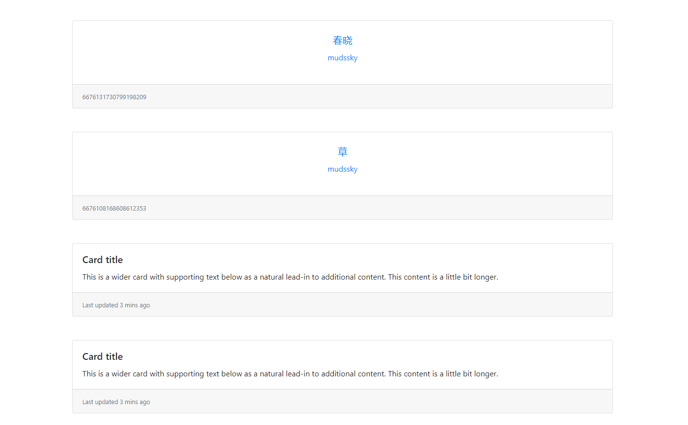


之后我们再实现点击首页的连接，跳转到指定的页面能显示出来

相当于是一个查找功能。

页面实现如下

```html
{{template "header"}}
{{template "navbar"}}
<div class="container mt-5">
  {{if .signin}}
  <a href="/postid/edit?id={{.post.IDhex}}" class="btn btn-primary form-control">Edit</a>
  <a href="/postid/delete?id={{.post.IDhex}}" class="btn btn-danger form-control">Delete</a>
  {{end}}
    <h1>{{.post.Title}}</h1>
</div>
<div class="container mt-5" id="article">

</div>
<script src="/static/js/benweet-stackedit.js-5f37fa9/docs/lib/stackedit.js"></script>
<script>
 const el = document.querySelector('#article');
  const stackedit = new Stackedit();

  // Open the iframe
  stackedit.openFile({
    name: 'Filename', // with an optional filename
    content: {
      text: `{{.post.Content}}`// and the Markdown content.
    }
    // slient 模式，编辑器不会弹出，只是渲染页面使用
  },true);
  // Listen to StackEdit events and apply the changes to the textarea.
  stackedit.on('fileChange', (file) => {
    el.innerHTML = file.content.html;
  });
</script>
{{template "footer"}}
```

路由实现如下

```go
http.HandleFunc("/postid", PostIDHandle)              //获取显示指定文章


// PostIDHandle 根据monggodb的ID字符串来查找文章，返回对应hexid的文章页
func PostIDHandle(w http.ResponseWriter, r *http.Request) {
	urlValue := r.URL.Query()
	idhex := urlValue["id"][0]
	if idhex == "" {
		return
	}
	sess := session.New()
	sess = sess.SessionStart(w, r)
	// 判断是否登录，若没有登录则没有权限，登录后sigin标志会变成true
	if checkSignin(sess.Data) != true {
		return
	}
	curpost := &post.Post{}
	err := curpost.FindPostByIDhex(idhex)
	// 如果获取文章出错，跳转到404页面
	if err != nil {
		LogPanic.Panicln("获取文章失败", err)
		http.Redirect(w, r, "/404", http.StatusNotFound)
		return
	}
	sess.Data["post"] = curpost
	temp, err := template.ParseFiles("views/post.html", "views/components/footer.html", "views/components/header.html", "views/components/navbar.html")
	if err != nil {
		LogPanic.Panicln("parse all templates failed", err)
	}
	err = temp.ExecuteTemplate(w, "post.html", sess.Data)
	if err != nil {
		LogPanic.Panicln("parse template views/post.html failed", err)
	}
}
```


接着我们再实现编辑文章的功能，而且这个功能需要检查是否登录，因为目前只有我能登录，等到有更多人能登录的时候，应该就是检查管理员权限的时候了。


路由实现如下

```go
	http.HandleFunc("/postid/edit", PostIDEditHandle)     //编辑指定文章


// PostIDEditHandle 浏览文章的时候可以对指定文章进行编辑操作
func PostIDEditHandle(w http.ResponseWriter, r *http.Request) {
	//1.检查url参数和登录状况
	urlValue := r.URL.Query()
	idhex := urlValue["id"][0]
	if idhex == "" {
		return
	}
	sess := session.New()
	sess = sess.SessionStart(w, r)
	// 判断是否登录，若没有登录则没有权限，登录后sigin标志会变成true
	if checkSignin(sess.Data) != true {
		return
	}
	if r.Method == "GET" {
		curpost := &post.Post{}
		// 查询对应的文章信息
		err := curpost.FindPostByIDhex(idhex)
		// 如果出错说明没有找到，重定向到404
		if err != nil {
			http.Redirect(w, r, "/404", http.StatusNotFound)
			return
		}
		// 找到后渲染到文章编辑页，编辑页基本上和新建页是一样的
		sess.Data["post"] = curpost
		temp, err := template.ParseFiles("views/edit.html", "views/components/footer.html", "views/components/header.html", "views/components/navbar.html")
		if err != nil {
			LogPanic.Panicln("parse all templates failed", err)
		}
		err = temp.ExecuteTemplate(w, "edit.html", sess.Data)
		if err != nil {
			LogPanic.Panicln("parse template views/edit.html failed", err)
		}
		return
	}
	if r.Method == "POST" {
		r.ParseForm()
		Author := r.Form["Author"][0]
		Title := r.Form["Title"][0]
		Content := r.Form["Content"][0]
		Category := r.Form["Category"][0]
		newpost := post.New(Author, Title, Content, Category)
		newpost.IDhex = idhex
		err := newpost.Update()
		// 如果更新过程出错，说明给的文章id出错，同样重定向到404
		if err != nil {
			LogPanic.Println("更新文章失败", err)
			http.Redirect(w, r, "/404", http.StatusNotFound)
			return
		}
		message := MessagePage{Message: "更新文章成功", URL: "/postid?id=" + idhex}
		showJumpMessage(message, w)
	}
}
func showJumpMessage(message MessagePage, w http.ResponseWriter) {
	temp, err := template.ParseFiles("views/messagepage.html", "views/components/footer.html")
	if err != nil {
		LogPanic.Panicln("parse all templates failed", err)
	}
	err = temp.ExecuteTemplate(w, "messagepage.html", message)
	if err != nil {
		LogPanic.Panicln("parse template views/messagepage.html failed", err)
	}
}
```


然后我们还需要一个删除功能

路由实现如下

```go

	http.HandleFunc("/postid/delete", PostIDDeleteHandle) //删除指定文章


// PostIDDeleteHandle 根据指定id删除对应文章的处理器
func PostIDDeleteHandle(w http.ResponseWriter, r *http.Request) {
	//1.检查url参数和登录状况
	urlValue := r.URL.Query()
	idhex := urlValue["id"][0]
	if idhex == "" {
		return
	}
	sess := session.New()
	sess = sess.SessionStart(w, r)
	// 判断是否登录，若没有登录则没有权限，登录后sigin标志会变成true
	if checkSignin(sess.Data) != true {
		return
	}
	if r.Method == "GET" {
		curpost := &post.Post{}
		// 查询对应的文章信息
		err := curpost.DeleteByIDhex(idhex)
		// 如果出错，说明删除失败，
		if err != nil {
			LogPanic.Println("删除文章失败", err)
			http.Redirect(w, r, "/404", http.StatusNotFound)
			return
		}
		message := MessagePage{"删除文章成功", "/"}
		showJumpMessage(message, w)
	}
}
```


最终post结构体的各种增删改查方法如下

```go
package post

import (
	"log"
	"time"

	"github.com/globalsign/mgo/bson"

	"github.com/globalsign/mgo"
)

// Post 文章的结构体
type Post struct {
	ID           bson.ObjectId       `bson:"_id"`
	IDhex        string              `bson:"idhex"`
	Author       string              `bson:"author"`
	Title        string              `bson:"title"`
	Content      string              `bson:"content"`
	CreatAt      bson.MongoTimestamp `bson:"creatat"`
	LastModified bson.MongoTimestamp `bson:"lastmodified"`
	Category     string              `bson:"category"`
}

var (
	session    *mgo.Session
	database   *mgo.Database
	collection *mgo.Collection
)

// Init 初始化一个Post结构体，根据提供的参数
func (p *Post) Init(Author string, Title string, Content string, Category string) *Post {
	p.ID = bson.NewObjectId()
	p.IDhex = p.ID.Hex()
	p.Author = Author
	p.Title = Title
	p.Content = Content
	p.Category = Category
	p.CreatAt, _ = bson.NewMongoTimestamp(time.Now(), 1)
	p.LastModified = p.CreatAt
	return p
}

// New 返回一个初始化的POST结构体，根据提供的参数
func New(Author string, Title string, Content string, Category string) *Post {
	return new(Post).Init(Author, Title, Content, Category)
}

// Add 添加一篇文章的数据到数据库,如果插入过程中出错，会返回错误对象
func (p *Post) Add() error {
	c := GetCollection()
	err := c.Insert(p)
	return err
}

// FindPostByIDhex 通过ID来查找文章数据并返回
func (p *Post) FindPostByIDhex(objectidhex string) (err error) {
	objid := bson.ObjectIdHex(objectidhex)
	c := GetCollection()
	err = c.FindId(objid).One(p)
	return
}

// GetPostsIndex 获取首页需要用到的文章信息
func (p *Post) GetPostsIndex() (res []interface{}, err error) {
	c := GetCollection()
	err = c.Find(bson.M{}).Select(bson.M{"idhex": 1, "title": 1, "lastmodified": 1, "author": 1}).All(&res)
	return
}

// Update 更新数据库中的文章信息，需要修改文章结构体后再调用，根据文章ID进行更新
func (p *Post) Update() error {
	p.ID = bson.ObjectIdHex(p.IDhex)
	c := GetCollection()
	err := c.Update(bson.M{"_id": p.ID}, bson.M{"$set": bson.M{"lastmodified": p.LastModified, "author": p.Author, "category": p.Category, "content": p.Content, "title": p.Title}})
	return err
}

// DeleteByID 通过ID删除文章数据
func (p *Post) DeleteByID(id bson.ObjectId) error {
	c := GetCollection()
	err := c.RemoveId(id)
	return err
}

// DeleteByIDhex 通过IDhex 字符串删除文章数据
func (p *Post) DeleteByIDhex(idhex string) error {
	p.ID = bson.ObjectIdHex(idhex)
	c := GetCollection()
	err := c.RemoveId(p.ID)
	return err
}
func init() {
	dialInfo := &mgo.DialInfo{
		Addrs:     []string{"127.0.0.1:27017"},
		Timeout:   time.Second * 1,
		PoolLimit: 4096,
	}
	// 创建一个维护套接字池的session
	session, err := mgo.DialWithInfo(dialInfo)
	if err != nil {
		log.Panicln("dial database failed", err)
	}
	database = session.DB("goblog")
	collection = database.C("post")
}

// GetDatabase 获取数据库对象
func GetDatabase() *mgo.Database {
	return database
}

// GetCollection 获取集合对象
func GetCollection() *mgo.Collection {
	return collection
}
func main() {

}

```


### 04.页面样式优化

​	到现在，最基础的需求已经都实现，接下来我们要做的还有，文章分页，文章分类，以及文章搜索功能。还有就是登录功能完善。因为目前用的是明文密码，问题还小，要做哈希。

​	所以是时候完善一下页面了，至少把基本的样子搞出来。	


​	首先是首页图标和brand的设计。brand通常是公司或网站的名字，比如知乎。因此不用特地设计图标也可以。

​	favicon是

这类图标大小为16x16px，最大为128x128px，所以我用ps先设计128x128px的图标，再转换成16x16图像质量就还可以。

还有图像格式要求是.ico，这是windows所使用的图标格式。有一些在线网站可以转换。

在html头部加上这么一个link指明图标的位置

```html
   <link rel="shortcut icon" href=" /static/favicon.ico" /> 
```


除此之外，我们之前文章块很多信息也没有显示，排版也需要改进。还有可以引入一些icon增强可读性。

具体实现效果如下：

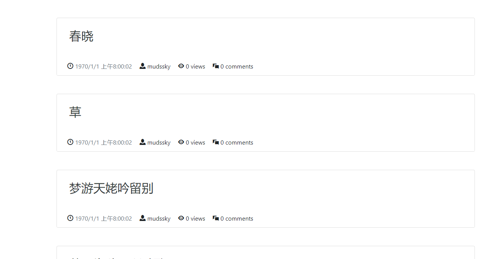

​	首先是时间的问题，之前时间存储我用的是mongodb里面的timestamp类型。这个类型转换成正常时间还是有点问题。

​	mongodb的timestamp由两部分组成，一部分是unix时间戳，另一部分是一个count值。count值是为了在同一unix时间下插入，插入不同的count值可以使得timestamp不冲突。

​	但是默认采用的是utc时间，默认的函数转的是utc时间。这不符合我的需求。mgo的文档可以说也不是很完善，毕竟go语言整个语言用的人都不多。

​	还有一点mongodb的时间戳肉眼看过去也更难懂。

​	所以我决定换个方案，用`time.Now（）`方式存到mongodb里面就是date类型。类似于字符串，这样，

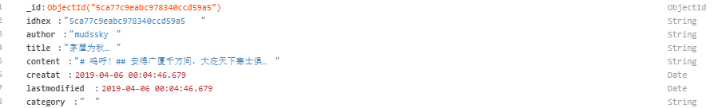

​	这个应该说基本上满足我的需求了。

​	阅读也比较方便。但是有多余的东西，就是后面的毫秒...

​	实际上我就应该用这种格式，但是这个其实也有个问题，就是go语言默认提取出这个数据

​	是下面这样的


​	确实和网上说的问题一样，存进去是正常的，取出来的时间转换成utc时间了。

​	不管怎么样，最后取出来都要根据unix时间戳转换成合适的格式，所以我就放弃了，反正无论怎样都要转换，干脆直接存unix时间戳进去。然后取出来转换成合适的格式。

​	从时间戳转换为正常时间的方法比较多。我选择在前端用js进行转换。

​	代码如下：

```JavaScript
<script>
     function ConvertUnixnanoStr(unixnanoStr){
      //  获取unix秒数的INT值
        unixInt=parseInt(unixnanoStr.slice(0,-6))
        // 转换为date类型
        return new Date(unixInt)
     }
 window.onload=function(){
  let lastmodifiedList=document.querySelectorAll('#lastmodified')
  for (var lastmodified of lastmodifiedList){
      unixnanoStr=  lastmodified.textContent
      dateObj=ConvertUnixnanoStr(unixnanoStr)
      // year=dateObj.getFullYear()
      // month=dateObj.getMonth()+1
      // day=dateObj.getDate()
      // month=month>10?month+'':'0'+month
      // day=day>10?day:'0'+day
      // dateStr=year+'-'+month+'-'+day

      lastmodified.textContent=dateObj.toLocaleDateString()+' '+dateObj.toLocaleTimeString()
  }
 }</script>
```


如此一来首页部分就处理的差不多了。暂时就先这样。

接下来文章展示部分我们也需要调整。

和首页的列表展示一样，需要添加上一些信息。

排版也要调整.

首先我发现了一个问题，默认用的stackedit来渲染marked，但是对比typora里面显示的效果 差了很多。比如代码块完全没有效果。


于是我准备用marked.js渲染，寻思这货渲染的效果应该能和typora差不多了吧。没想到结果是一样的。

翻了翻marked的官方文档，渲染时有一些选项可以配置。其中比较突出的一个就是highlight，highlight.js专门做语法高亮这方面的工作。

还有一个异步渲染的语法高亮，但是github上发现star数不是很多。配置方法查起来也比较麻烦，因为官方文档都是node环境怎么配置的。而我是要在web页面中引用。

所以我选择highlight.js。

marked.js官网现成就有配置方法。

首先需要引入两个文件，一个是语法高亮的样式文件，一个是js文件

```html
<link rel="stylesheet" href="/static/vender/highlight.js-master/src/styles/vs2015.css">
<script src="/static/vender/highlight.js-master/build/browser/highlight.pack.js"></script>
```

先执行初始化操作，然后在mark的setoption里面配置就可以了。

```js
 const el = document.querySelector('#article');
 const articleDom=document.querySelector('.invisible')
 hljs.initHighlightingOnLoad();
 marked.setOptions({
  renderer: new marked.Renderer(),
  highlight: function(code) {
    return hljs.highlightAuto(code).value;
  },
  pedantic: false,
  gfm: true,
  tables: true,
  breaks: false,
  sanitize: false,
  smartLists: true,
  smartypants: false,
  xhtml: false
});
 el.innerHTML=marked(articleDom.innerHTML)
```


我选择用vs2015主题，因为感觉和vscode默认主题挺像的。另外还有一个sublime默认主题的样式也是不错的。

根据官方的说法，支持185种语言，89种样式

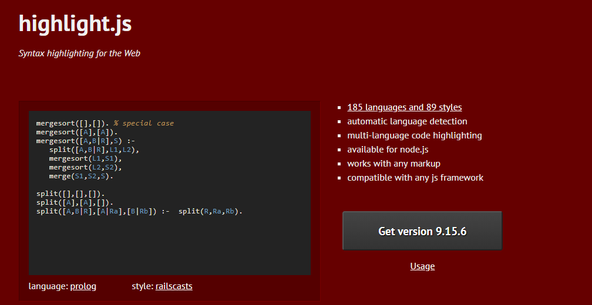

我把github上的项目下载之后，把所有语言编译出了js有700kb左右，也是够大的。

不过正常20语言版本的也就只有70kb左右而已。


除了代码高亮之外，还有一个很实用的功能是点击复制。

我想来想去，有一个clipboard.js的库，能不能满足我的需求呢？

clipboard的demo官网翻遍了，发现给的例子都和我的需求有点不一样。

他很多都是通过html5的自定义属性来实现。然而我要复制的是一大段代码文件，如果里面有双引号，会把html属性的双引号闭合会有bug。

最后我发现有一种方式算是适合吧


```js
window.onload=function(){
  $('code').each(function(index){
    $(this).attr('id','code'+index)
    $(this).before($('<button class="btn btn-secondary float-right  copyBtn'+index+'" data-clipboard-action="copy" data-clipboard-target="#code'+index+'">Copy</button>'))
   new ClipboardJS('.copyBtn'+index);
  })}

```


具体实现的效果如下

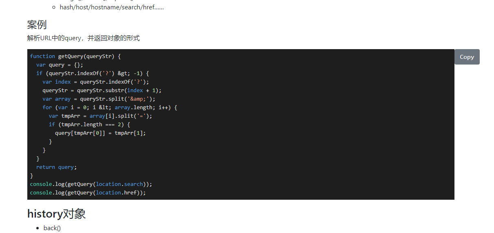


还有一个问题是原来在typora里面有一个TOC的功能，就是table of content

根据分级标题，自动生成一个索引目录。

但是marked.js渲染是没有渲染出来的

然后我从网上找答案

通过marked的renderer进行配置，能提高一点效率？然而我看官方文档，没看懂。


索性jquery一把梭，自己撸一个。

主要是把h开头的标签都找出来，然后按顺序创建dom，加上对应的缩进

具体实现如下

```js
  tocDiv=$('#toc')
  $(':header').each(function(index,element){
    // 获取id实现锚点功能
    hID=$(this).attr('id')
    // 获取h标签后的数字，实现缩进
    hNum=$(this).prop("tagName").slice(1)
    // console.log(hNum)
    tocDiv.append($('<li><a class="btn" style="padding-left:'+hNum*2 +'rem" href="#'+hID+'">'+element.textContent +'</a></li>'))
  }) 
```

效果如下

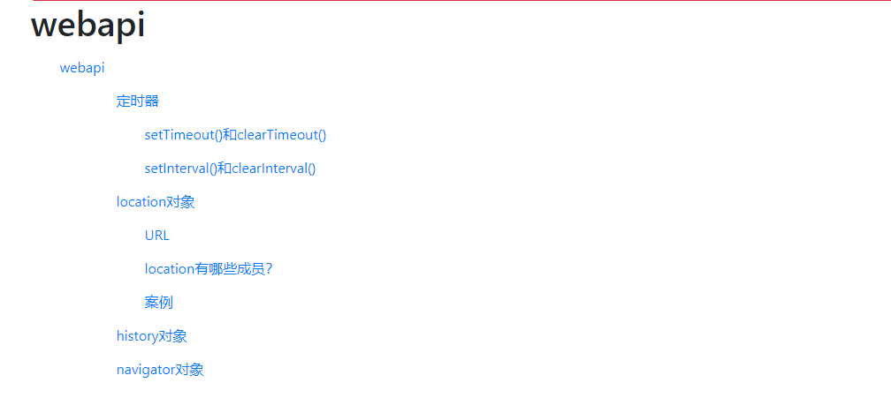

### 05.文章分类标签增删改查实现

​	

​	按照之前的步骤已经实现了基本功能，我觉得只要再加上分类和上传文件图片功能（直接上传markdown文档进行发布）就可以上线了。

​	之后还是要完善分页功能和样式就是了。

​	

​	很显然，每篇文章的标签都会是一个列表，可能有多个标签。

​	首先我们要实现增加标签的功能，这样先加几个标签进去，我们新建文章的时候就可以从数据库读出来给我们选。

​	显然这个功能也是要等登录后才能使用的，所以索性和注销按钮放一个位置了。

​	

​	花了点时间，终于分类的增删改查也实现了。

​	首先我们需要一个新建标签的功能

​	页面设计如下

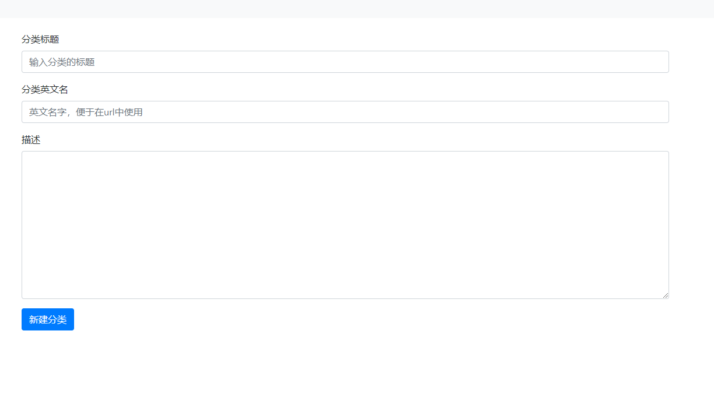

```html
{{template "header"}}
{{template "navbar" .}}
<div class="container mt-4">
    <form action="/category/new" method="POST">
        <div class="form-group">
            <label for="categoryTitle">分类标题</label>
            <input type="text" name="Name" class="form-control" id="categoryTitle"  placeholder="输入分类的标题">
        </div>
        <div class="form-group">
            <label for="EnglishName">分类英文名</label>
            <input type="text" name="EnglishName" class="form-control" id="EnglishName"  placeholder="英文名字，便于在url中使用">
        </div>
        <div class="form-group">
            <label>描述</label>
            <textarea name="Description" rows="10" id="categoryDesc" class="form-control"></textarea>
        </div>
        <button type="submit" class="btn btn-primary">新建分类</button>
   </form>
   </div>

{{template "footer"}}
```

然后完成新建标签的路由和逻辑

```go
http.HandleFunc("/category/new", NewCategoryHandle)       //添加标签页面

// NewCategoryHandle 处理新建分类页面的路由,首先要检查登录状况
func NewCategoryHandle(w http.ResponseWriter, r *http.Request) {
	sess := session.New()
	sess = sess.SessionStart(w, r)
	if checkSignin(sess.Data) != true {
		return
	}
	if r.Method == "GET" {
		temp, err := template.ParseFiles("views/newcategory.html", "views/components/footer.html", "views/components/header.html", "views/components/navbar.html")
		if err != nil {
			LogPanic.Panicln("parse all templates failed", err)
		}
		err = temp.ExecuteTemplate(w, "newcategory.html", sess.Data)
		if err != nil {
			LogPanic.Panicln("parse template views/newcategory.html failed", err)
		}
	}

	if r.Method == "POST" {
		r.ParseForm()
		// 因为是只有登录了才能新建Category，所以多余的表单信息验证也不需要了。
		LogDebug.Println(r.Form)
		Name := r.Form.Get("Name")
		EnglishName := r.Form.Get("EnglishName")
		Description := r.Form.Get("Description")
		NewCategory := category.New(Name, EnglishName, Description)
		NewCategory.Add()
		showJumpMessage(MessagePage{Message: "添加分类成功", URL: "/category"}, w)
	}
}

```


之后完成展示分类列表的页面

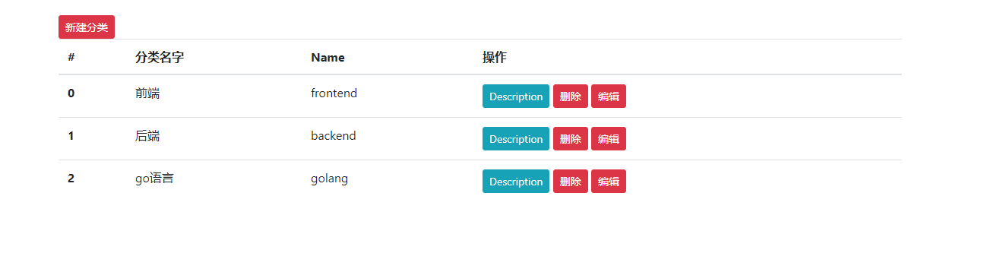

```html
{{template "header"}}
{{template "navbar" .}}
<div class="container mt-5">
    <a href="/category/new" class="btn btn-danger btn-sm">新建分类</a>
 <table class="table">
 <thead>
   <tr>
     <th scope="col">#</th>
     <th scope="col">分类名字</th>
     <th scope="col">Name</th>
     <th scope="col">操作</th>
   </tr>
 </thead>
 <tbody>
   {{range $i,$v := .CategoryList}}
   <tr>
     <th scope="row">{{$i}}</th>
     <td>{{$v.name}}</td>
     <td>{{$v.englishname}}</td>
     <td>
            <button type="button" class="btn btn-sm btn-info" data-toggle="popover" title="Description" data-content="{{$v.description}}">Description</button>
         <a href="/category/delete?id={{$v.idhex}}" class="btn btn-danger btn-sm">删除</a>
        <a href="/category/edit?id={{$v.idhex}}" class="btn btn-danger btn-sm">编辑</a></td>    
   </tr>
   {{end}}
 </tbody>
</table>
<script>
    window.onload=function(){
    
  $('[data-toggle="popover"]').popover()
    }
</script>
</div>
{{template "footer"}}
```

路由和逻辑处理

```go
http.HandleFunc("/category", CategoryHandle)              //标签列表页面

// CategoryHandle 处理分类页的路由
func CategoryHandle(w http.ResponseWriter, r *http.Request) {
	sess := session.New()
	sess = sess.SessionStart(w, r)
	if r.Method == "GET" {
		categoryCotainer := category.Category{}
		res, finderr := categoryCotainer.FindAllCategory()
		if finderr != nil {
			LogPanic.Panicln("get all categoryinfo err", finderr)
		}
		sess.Data["CategoryList"] = res
		temp, err := template.ParseFiles("views/category.html", "views/components/footer.html", "views/components/header.html", "views/components/navbar.html")
		if err != nil {
			LogPanic.Panicln("parse all templates failed", err)
		}
		err = temp.ExecuteTemplate(w, "category.html", sess.Data)
		if err != nil {
			LogPanic.Panicln("parse template views/category.html failed", err)
		}
	}
}

```

删除可以用GET请求来实现，编辑可以用原来新建的页面，只是一开始要把可以编辑的项填好，方便修改。

以下是两个操作的路由

```go
	http.HandleFunc("/category/delete", CategoryDeleteHandle) //标签删除操作路由
	http.HandleFunc("/category/edit", CategoryEditHandle)     //标签编辑操作路由
```

两个操作都需要权限才能执行

```go
// CategoryDeleteHandle 执行删除的路由操作
func CategoryDeleteHandle(w http.ResponseWriter, r *http.Request) {
	if r.Method == "GET" {
		//检查url参数和登录状况,如果出错获取不到id，会panic没有做其他处理
		urlValue := r.URL.Query()
		idhex := urlValue.Get("id")
		if checkIDhexLen(idhex) {
			return
		}
		sess := session.New()
		sess = sess.SessionStart(w, r)
		if checkSignin(sess.Data) != true {
			showJumpMessage(MessagePage{Message: "只有管理员用户才能进行该操作", URL: "/category"}, w)
			return
		}
		categoryManage := category.Category{}
		err := categoryManage.FindByIDhexAndDelete(idhex)
		if err != nil {
			showJumpMessage(MessagePage{Message: "删除失败，未知错误", URL: "/category"}, w)
			LogPanic.Panicln("delete category failed", err)
			return
		}
		showJumpMessage(MessagePage{Message: "删除成功", URL: "/category"}, w)
	}

}

// CategoryEditHandle 处理标签编辑操作的路由
func CategoryEditHandle(w http.ResponseWriter, r *http.Request) {
	//检查url参数和登录状况,如果出错获取不到id，会panic没有做其他处理
	urlValue := r.URL.Query()
	idhex := urlValue.Get("id")
	if idhex == "" {
		return
	}
	sess := session.New()
	sess = sess.SessionStart(w, r)
	if checkSignin(sess.Data) != true {
		showJumpMessage(MessagePage{Message: "只有管理员用户才能进行该操作", URL: "/category"}, w)
		return
	}
	if r.Method == "GET" {
		categoryManage := category.Category{}
		err := categoryManage.FindOneCategoryInfoByIDhex(idhex)
		// 如果找不到或者查找过程出错
		if err != nil {
			showJumpMessage(MessagePage{Message: "访问目标，未知错误", URL: "/category"}, w)
			return
		}
		sess.Data["CategoryInfo"] = categoryManage
		temp, err := template.ParseFiles("views/editcategory.html", "views/components/footer.html", "views/components/header.html", "views/components/navbar.html")
		if err != nil {
			LogPanic.Panicln("parse all templates failed", err)
		}
		err = temp.ExecuteTemplate(w, "editcategory.html", sess.Data)
		if err != nil {
			LogPanic.Panicln("parse template views/editcategory.html failed", err)
		}
		return
	}
	if r.Method == "POST" {
		r.ParseForm()
		Name := r.Form.Get("Name")
		EnglishName := r.Form.Get("EnglishName")
		Description := r.Form.Get("Description")
		categoryCotainer := category.New(Name, EnglishName, Description)
		err := categoryCotainer.UpdateByIDhex(idhex)
		if err != nil {
			showJumpMessage(MessagePage{Message: "访问目标，未知错误", URL: "/category"}, w)
		}
		showJumpMessage(MessagePage{Message: "更新分类信息成功", URL: "/category"}, w)
	}
}
```


### 06.markdown文章上传，图片上传，以及文章分类功能添加

首先我们要实现文章加分类标签和编辑分类标签的功能。


​	使用mongodb一大难题，不知道多个表关联要怎么操作。因为post文章会有一个分类关键词列表，然后分类自己也有一个表，所以这两个表中的分类词总要保持统一吧。

​	然后在post的category列表要是什么类型呢？[]interface{}?这样可以直接把category结构体放进去，但是好像冗余信息很多。只放idhex？这样到时候文章显示分类又要重新查。

​	所以我想到，如果分类的标签本身不会重复，那么问题不就解决了吗？分类标签本身就起到了id的作用，相当于在关系型数据库中可以做主键。这样就不用多操心了。可以是string的列表了。

​	然后问题是分类列表怎么通过表单上传。

​	这也简单，我们用字符串上传就可以了。后端获取了再解析一遍。

​	

​	实现如下，传入一条字符串，不同名字之间用&隔开即可。

​	同时已经有的所有标签都列出来了，我们可以通过标签点击把他们加上，用jquery实现。

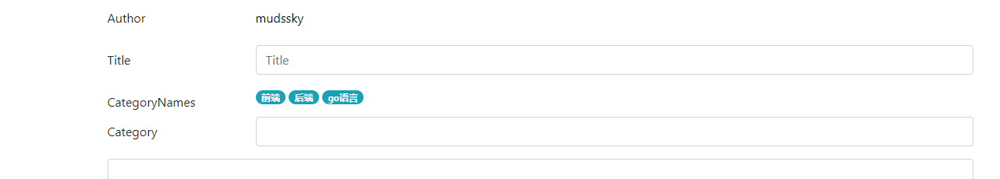

​	同时我们在新建文章的时候需要增加对应标签的count数。这部分代码就不贴了。


​	然后是比较重要的文章上传功能，我的设想是如果js能从本地加载文件，然后执行图片上传，把markdown对应的图片加载上传，链接替换成上传后的链接即可，然后把textarea文本框的内容替换，然后就可以通过表单提交了。和正常新建文章的程序一样，多了一步替换图片和图片地址而已。

​	图片保存名字使用图片文件的md5值，这样找起来方便，这种方式也比较通用。

​	但是有一个问题，js并不能直接读取本地的文件，所以一键上传的想法是不能实现了。基本上只能借助文件表单。不能直接读路径。据说用flash插件可以实现，但是flash早凉了，客户端支持不是很好，意义不大。

​	所以说上传图片和修改markdown的功能只能在本地完成了，需要编写一个命令行工具，自动修改图片的地址并进行上传。

​	然后网页端则是通过表单，把markdown文本读取到textarea就行。

​	

​	实现了通过文件表单读取内容到textarea或者直接拖拽文件到textarea。这两个是页面上需要的功能。

```js
 // (1)需要解决一旦拖拽外部文件就覆盖掉当前页面的问题
    //  解决：给document绑定drop事件 
    //  drop事件默认触发不了，需要在dragover事件里面阻止默认事件
   // 这个阻止默认事件是为了让drop事件得以触发
   document.ondragover = function(e){
      // console.log(1)
        e.preventDefault();
    }
   document.ondrop = function(e){
      // console.log(2)
        e.preventDefault();
    }
    // document.ondragenter = function(e){
    //    console.log('denter')
    //     e.preventDefault();
    // }

    // 实现直接拖拽文本文件 读取文本文件进入textarea、

    textBox=document.getElementById('textBox')
      textareaDom=document.getElementById('textarea')
   
      textBox.ondragenter=function(){
        console.log('enter')
        textBox.style.boxShadow = '0 0 10px 5px rgba(255,0,0,.8)';
      }
      textBox.ondrop=function(e){
        // 得到拖拽过来的文件对象
        console.log('drop')
        var fileObj=e.dataTransfer.files[0]
        // console.log(fileObj)
        var fr = new FileReader()
        
        fr.onload=function(){
          textareaDom.value=this.result
          textBox.style.boxShadow = '0 0 10px 5px rgba(255,0,0,0)';
        }
        fr.readAsText(fileObj)
        fr.onerror=function(e){
          console.log('drap error',e)
        }
      }
      // textBox.ondragover=function(e){
      //   textBox.style.boxShadow = '0 0 10px 5px rgba(255,0,0,.8)';
      // }
```


接下来我们要实现上传markdown里面的图片的app

图片需要计算md5作为文件名，上传到指定地址，同时替换markdown里面的地址。

同时需要加密，需要有密码，不然随便来个人就能上传了。

可以通过session来作为凭证。


其实这就是个简易的图床的功能，因为我平时写markdown并不用图床，不然的话完全不会有这个问题。


先熟悉一下go标准库编写命令行用的flag的使用。

```go
package main

import (
	"flag"
	"fmt"
)

func main() {
	/*-flag
	-flag=x
	-flag x  // 只有非bool类型的flag可以
	命令行有以上三种指明参数的方法
	一个 -  和两个 -- 连接符是一样的效果，对应的参数必须有连接符。
	*/

	namePtr := flag.String("name", "admin", "名字")
	agePtr := flag.Int("age", 18, "年龄")
	married := flag.Bool("married", false, "是否结婚了")

	// 可以事先定义变量，引用赋值
	var email string
	flag.StringVar(&email, "email", "none", "邮箱")

	flag.Parse()
	// Args方法用于获取 non-flag参数
	args := flag.Args()
	// NArgs 方法用于获取non-flag参数的个数
	nargs := flag.NArg()
	// NFlag 活气已经设置了的参数个数
	nflag := flag.NFlag()

	fmt.Println("name:", *namePtr)
	fmt.Println("age:", *agePtr)
	fmt.Println("married:", *married)
	fmt.Println("email:", email)
	fmt.Println("args:", args)
	fmt.Println("nargs:", nargs)
	fmt.Println("nflag:", nflag)
}

/*
 PrintDefaults() 打印所有已定义参数默认值
Flag结构体
 type Flag struct {
    Name     string // flag在命令行中的名字
    Usage    string // 帮助信息
    Value    Value  // 要设置的值
    DefValue string // 默认值（文本格式），用于使用信息
}

func (f *FlagSet) Lookup(name string) *Flag 返回已经注册的flag指针结构体

func (f *FlagSet) Visit(fn func(*Flag)) 遍历解析时设置了的标签
func (f *FlagSet) VisitAll(fn func(*Flag)) 遍历所有

*/

```


### 07.分页功能实现。

​	本来想先实现上传功能，因为学校晚上断网体验很差，想把hugo安装一下看看有没有类似的功能。因为网络问题下了半天

​	所以先把分页功能实现吧。总不能啥都不做就睡觉。

​	首先我们用js脚本在mongodb里面插入多一点的信息，100条。

```


for(var i=0;i<100;i++){
    // NumberInt可以将数据转换为int32 类型
    // timeStampNano= NumberInt((new Date()).getTime()*1000000)
    // NumberLong可以将数据转换为int64 类型
    // timeStampNano= NumberLong((new Date()).getTime()*1000000)
    _id=new ObjectId()
    date=new Date()
    newpost={
        _id:_id,
        idhex: _id.toString().slice(10,-2)  ,
        author:"mudssky",
        title:'test'+i,
        content:'content'+i,
        creatat: date,
        lastmodified:date,
        categoryList:[],
        viewscounts:0,
        commentCounts:0
    }
    db.post.insert(newpost)
}
```


分页功能需要两个函数

一个用于获取所有的页数，一个用于根据给定的页数，返回内容。

返回总页数：

```go
// PostCount  返回总文档数
func (p *Post) PostCount() (n int, err error) {
	c := GetCollection()
	n, err = c.Count()
	return
}

// PageNumCount  返回总页数
func (p *Post) PageNumCount() int {
	n, err := p.PostCount()
	// 错误处理，如果出错，只返回一页
	if err != nil {
		n = 1
	}
	n /= pageCount
	return n
}

```

根据页数，返回文档

```go
// GetPostsIndexPaged 分页，很明显需要每页显示的项目数，作为一个api，只需要输入页数返回对应的内容即可。
// 我们这里设置固定每页的文章数目 pageCount为10。除此之外我们每次要先计算总页数，也要写一个函数
func (p *Post) GetPostsIndexPaged(pageNum int) (res []interface{}, err error) {
	c := GetCollection()
	err = c.Find(bson.M{}).Select(bson.M{"idhex": 1, "title": 1, "lastmodified": 1, "author": 1, "viewscounts": 1, "commentscounts": 1}).Sort("-lastmodified").Skip(pageNum - 1).Limit(pageCount).All(&res)
	return
}
```


最后我们完成首页路由

由于go 标准库的模板功能比较匮乏，连基本的加减法函数都没有内置，所以采用了传入列表进行遍历的方法

```go
// IndexHandle 处理首页的逻辑
func IndexHandle(w http.ResponseWriter, r *http.Request) {
	if r.URL.Path == "/" {
		pageNum := 1
		urlValue := r.URL.Query()
		pageStr := urlValue.Get("page")
		if pageStr != "" {
			pageNum, _ = strconv.Atoi(pageStr)
		}
		posts := post.Post{}
		pageNumCount := posts.PageNumCount()
		if pageNum > pageNumCount || pageNum < 1 {
			pageNum = 1
		}
		postindex, err := posts.GetPostsIndexPaged(pageNum)
		LogDebug.Println(postindex)
		LogDebug.Println("path", "/")
		// 解析需要的模板
		temp, err := template.ParseFiles("views/index.html", "views/components/navbar.html", "views/components/footer.html",
			"views/components/header.html")
		// temp, err := template.ParseFiles("views/index.html")
		if err != nil {
			LogPanic.Panicln("parse template views/index.html failed", err)
		}
		// 获取session中的数据
		sess := session.New()
		sess = sess.SessionStart(w, r)
		// SessionMap = sess.Data
		// LogDebug.Println(sess.Data["signin"])
		previousNum := pageNum - 1
		if pageNum <= 1 {
			previousNum = 0
		}
		nextNum := pageNum + 1
		if nextNum > pageNumCount {
			nextNum = 0
		}
		sess.Data["postindex"] = postindex
		sess.Data["pageNumList"] = []int{pageNum, pageNum + 1, pageNum + 2}
		sess.Data["pageNumCount"] = pageNumCount
		sess.Data["previousNum"] = previousNum
		sess.Data["nextNum"] = nextNum
		err = temp.ExecuteTemplate(w, "index", sess.Data)
		if err != nil {
			LogPanic.Panicln("parse template views/index.html failed", err)
		}
		// http包默认的路由规则，按照最长前缀匹配
		// 所有路径都可以匹配到/,那样404页面就失去作用了，所以当/匹配失败的时候展示404页面
	} else {
		temp, err := template.ParseFiles("views/404.html")
		// temp, err := template.ParseFiles("views/index.html")
		if err != nil {
			LogPanic.Panicln("parse template views/404.html failed", err)
		}
		err = temp.ExecuteTemplate(w, "404.html", nil)
		if err != nil {
			LogPanic.Panicln("parse template views/404.html failed", err)
		}
	}
}
```

最后我们完成页面上的逻辑

```html
 <nav class="mt-2">
      <ul class="pagination justify-content-center">
          {{if ne .previousNum  0}}
        <li class="page-item">
          <a class="page-link" href="/?page={{.previousNum}}">Previous</a>
        </li>
        {{else}}
        <li class="page-item disabled">
            <a class="page-link" href="#" tabindex="-1">Previous</a>
          </li>
        {{end}}
        {{$count:=.pageNumCount}}
        {{range $i,$v:= .pageNumList}}
        {{if le $v $count}}
            {{if eq $i 0}}
          <li class="page-item active"><a class="page-link" href="/?page={{$v}}">{{$v}}</a></li>
          {{else}}
          <li class="page-item"><a class="page-link" href="/?page={{$v}}">{{$v}}</a></li>
          {{end}}
        {{end}}
       {{end}}
        <li class="page-item disabled" style="line-height: 1em;vertical-align: middle"><a class="page-link" href="#">...</a></li>
       
          {{ if ne .nextNum  0}}
          <li class="page-item">
              <a class="page-link" href="/?page={{.nextNum}}">Next</a>
            </li>
          {{else}}
          <li class="page-item disabled">
              <a class="page-link" href="#">Next</a>
            </li>
          {{end}}
      </ul>
      <ul class="pagination justify-content-center" style="display:none" id="pageAlert">
          <div class="alert alert-warning" role="alert">
             请使用正确的页数
            </div>
        </ul>
      <ul class="pagination justify-content-center">
          <li class="page-item">
            共 <span id="pageNumCount">{{.pageNumCount}}</span>页<input type="text" class="mx-2" id="jumpPage" style="width:40px"><button id="jumpBtn">跳转</button>
            </li>
        </ul>
    </nav>
```

实现效果如下

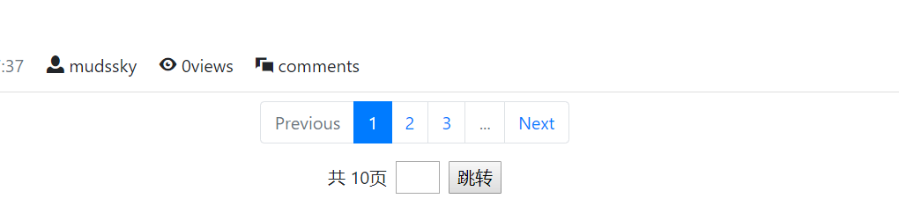

跳转功能包括输入框输入数字后回车，或者点击跳转按钮两个事件。

并且检测数字，如果超过总页数将弹出错误提示

至此，分页功能算是基本完成